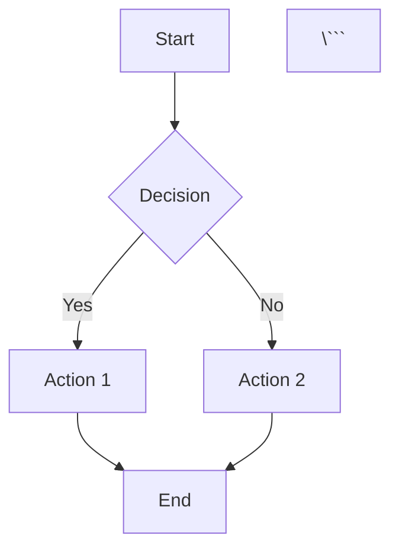

# Docusaurus Chapter Template Skill

---
name: docusaurus_chapter_template
description: Generate consistent, reusable chapter structures for Physical AI & Robotics textbook
version: 1.0.0
project: physical-ai-robotics-textbook
parameters:
  - name: chapter_number
    description: Chapter number (e.g., 01, 02, 03)
    required: true
  - name: chapter_slug
    description: URL-friendly chapter identifier (e.g., ros2-basics, kinematics)
    required: true
  - name: chapter_title
    description: Display title for the chapter
    required: true
  - name: include_interactive
    description: Include interactive components (quizzes, diagrams)
    required: false
    default: true
---

## Purpose

Generate production-ready Docusaurus chapter templates that:
- **Enforce consistent structure** across all textbook chapters
- **Produce MDX-compatible content** with Docusaurus features
- **Define fixed 5-section layout** (Introduction → Theory → Code → Simulation → Exercises)
- **Ensure reusability** - same structure for every chapter
- **Support interactive features** - code blocks, admonitions, tabs, diagrams

## Fixed Chapter Structure

**MANDATORY SECTIONS** (must appear in this exact order):

1. **Introduction** - Learning objectives, prerequisites, overview
2. **Theory** - Conceptual foundations, mathematics, principles
3. **Code Explanation** - Implementation details, code walkthrough
4. **Simulation** - Practical examples, Gazebo/Isaac Sim setup
5. **Exercises** - Hands-on practice, challenges, assessment

## Core Principles

**MUST FOLLOW:**
1. **Structure Invariance**: All chapters use identical section order
2. **MDX Compatibility**: Valid Docusaurus MDX syntax
3. **No Backend Logic**: Pure frontend/documentation concerns
4. **Accessibility**: Proper heading hierarchy, alt text, semantic HTML
5. **Internationalization Ready**: Structure supports i18n
6. **Interactive First**: Use Docusaurus features (admonitions, tabs, code blocks)

## Instructions

### Step 1: Define Chapter Template Structure

Create the base MDX template:

```mdx
---
# Frontmatter (YAML)
id: {chapter_slug}
title: "Chapter {chapter_number}: {chapter_title}"
sidebar_label: "{chapter_number}. {chapter_title}"
sidebar_position: {chapter_number}
description: {chapter_description}
keywords:
  - {keyword1}
  - {keyword2}
  - {keyword3}
tags:
  - {tag1}
  - {tag2}
---

import Tabs from '@theme/Tabs';
import TabItem from '@theme/TabItem';
import CodeBlock from '@theme/CodeBlock';

# Chapter {chapter_number}: {chapter_title}

<div className="chapter-header">
  <p className="chapter-meta">
    <strong>Estimated Time:</strong> {estimated_time} hours |
    <strong>Difficulty:</strong> {difficulty}
  </p>
</div>

---

## 1. Introduction

### Learning Objectives

By the end of this chapter, you will be able to:

- 🎯 **Objective 1**: {description}
- 🎯 **Objective 2**: {description}
- 🎯 **Objective 3**: {description}
- 🎯 **Objective 4**: {description}

### Prerequisites

:::info Prerequisites
Before starting this chapter, you should be familiar with:

- ✅ **{Prerequisite 1}**: {brief description}
- ✅ **{Prerequisite 2}**: {brief description}
- ✅ **{Prerequisite 3}**: {brief description}

If you need a refresher, review:
- [Chapter {X}: {Title}](../chapter-link)
- [External Resource](#)
:::

### Chapter Overview

{2-3 paragraph overview of the chapter content and why it matters}

**What You'll Build:**
- {Tangible outcome 1}
- {Tangible outcome 2}
- {Tangible outcome 3}

---

## 2. Theory

### Conceptual Foundation

{Introduction to the theoretical concepts}

#### {Concept 1 Name}

{Detailed explanation of concept 1}

**Key Points:**
- Point 1
- Point 2
- Point 3

:::tip Understanding {Concept}
{Helpful tip or analogy to understand the concept}
:::

#### {Concept 2 Name}

{Detailed explanation of concept 2}

### Mathematical Foundations

{If applicable, mathematical formulations}

#### {Formula Name}

The relationship can be expressed as:

```math
{LaTeX equation}
```

Where:
- `{variable1}` = {description}
- `{variable2}` = {description}
- `{variable3}` = {description}

**Example Calculation:**

```python
# Example numerical calculation
variable1 = 10
variable2 = 5
result = variable1 * variable2  # Result: 50
print(f"Result: {result}")
```

### Visual Explanation

{Diagram or illustration placeholder}

```mermaid
graph LR
    A[{Component 1}] --> B[{Component 2}]
    B --> C[{Component 3}]
    C --> D[{Output}]
```

:::caution Common Misconception
{Address a common misunderstanding about the theory}
:::

---

## 3. Code Explanation

### Architecture Overview

{High-level overview of the code structure}

```
{project_name}/
├── {directory1}/
│   ├── {file1.py}
│   └── {file2.py}
├── {directory2}/
│   └── {file3.py}
└── {main_file.py}
```

### Implementation Details

#### Step 1: {Step Name}

{Explanation of what this step does and why}

<Tabs>
<TabItem value="python" label="Python" default>

```python title="{filename.py}"
# {Description of code block}

import {module}

class {ClassName}:
    """
    {Class description}

    Attributes:
        {attr1}: {description}
        {attr2}: {description}
    """

    def __init__(self, {params}):
        self.{attr1} = {params}

    def {method_name}(self, {params}):
        """
        {Method description}

        Args:
            {param1}: {description}

        Returns:
            {return_description}
        """
        # Implementation
        return {result}

# Example usage
instance = {ClassName}({args})
result = instance.{method_name}({args})
print(f"Result: {result}")
```

</TabItem>
<TabItem value="cpp" label="C++">

```cpp title="{filename.cpp}"
// {Description of code block}

#include <{header}>

class {ClassName} {
public:
    {ClassName}({params}) {
        // Constructor
    }

    {return_type} {method_name}({params}) {
        // Implementation
        return {result};
    }

private:
    {type} {member_variable};
};

// Example usage
{ClassName} instance({args});
auto result = instance.{method_name}({args});
```

</TabItem>
</Tabs>

**Code Breakdown:**

1. **Line {X}-{Y}**: {Explanation}
2. **Line {X}-{Y}**: {Explanation}
3. **Line {X}-{Y}**: {Explanation}

:::tip Best Practice
{Best practice tip related to the code}
:::

#### Step 2: {Step Name}

{Continue with additional implementation steps}

### Complete Example

{Full working example that ties everything together}

```python title="complete_example.py" showLineNumbers
#!/usr/bin/env python3
"""
Complete working example for Chapter {chapter_number}

This example demonstrates:
- {Feature 1}
- {Feature 2}
- {Feature 3}
"""

# {Full implementation}
```

:::note Testing Your Code
To run this example:

```bash
# Clone the repository
git clone {repo_url}

# Navigate to chapter directory
cd chapter-{chapter_number}

# Install dependencies
pip install -r requirements.txt

# Run the example
python3 complete_example.py
```
:::

---

## 4. Simulation

### Setting Up the Simulation Environment

{Instructions for setting up Gazebo/Isaac Sim/other simulation}

#### Installation

<Tabs groupId="sim-platform">
<TabItem value="gazebo" label="Gazebo" default>

```bash
# Install Gazebo for ROS 2
sudo apt update
sudo apt install ros-{ros_distro}-gazebo-ros-pkgs
```

</TabItem>
<TabItem value="isaac" label="Isaac Sim">

```bash
# Download Isaac Sim from NVIDIA
# https://developer.nvidia.com/isaac-sim

# Install required dependencies
pip install isaacsim
```

</TabItem>
</Tabs>

#### World Configuration

{Simulation world setup}

```xml title="worlds/{chapter_slug}.world"
<?xml version="1.0"?>
<sdf version="1.6">
  <world name="{world_name}">
    <!-- World configuration -->

    <include>
      <uri>model://sun</uri>
    </include>

    <include>
      <uri>model://ground_plane</uri>
    </include>

    <!-- Add your models here -->

  </world>
</sdf>
```

### Running the Simulation

{Step-by-step instructions}

**Step 1: Launch the simulation**

```bash
# Terminal 1: Launch Gazebo
ros2 launch {package_name} {launch_file}.launch.py
```

**Step 2: Run your code**

```bash
# Terminal 2: Run the controller
ros2 run {package_name} {node_name}
```

**Step 3: Visualize in RViz**

```bash
# Terminal 3: Launch RViz
ros2 launch {package_name} rviz.launch.py
```

### Expected Behavior

{Description of what should happen in the simulation}

:::success Success Indicators
You should see:
- ✅ {Expected behavior 1}
- ✅ {Expected behavior 2}
- ✅ {Expected behavior 3}
:::

### Troubleshooting

<details>
<summary><strong>Issue: {Common Problem}</strong></summary>

**Symptom**: {Description of the problem}

**Solution**:
1. {Step 1}
2. {Step 2}
3. {Step 3}

</details>

<details>
<summary><strong>Issue: {Another Problem}</strong></summary>

**Symptom**: {Description}

**Solution**: {Solution steps}

</details>

---

## 5. Exercises

### Exercise 1: {Exercise Name} (⭐ Beginner)

**Objective**: {What the student should accomplish}

**Task**:
{Detailed description of the task}

**Requirements**:
- ✅ {Requirement 1}
- ✅ {Requirement 2}
- ✅ {Requirement 3}

**Starter Code**:

```python
# TODO: Complete this implementation
def {function_name}({params}):
    """
    {Description}
    """
    # Your code here
    pass

# Test your implementation
result = {function_name}({test_args})
assert result == {expected}, f"Expected {expected}, got {result}"
```

<details>
<summary><strong>💡 Hint</strong></summary>

{Helpful hint without giving away the solution}

</details>

<details>
<summary><strong>✅ Solution</strong></summary>

```python
def {function_name}({params}):
    """
    {Description}
    """
    # Solution implementation
    {implementation}
    return {result}
```

**Explanation**:
{Explanation of the solution}

</details>

---

### Exercise 2: {Exercise Name} (⭐⭐ Intermediate)

**Objective**: {More complex objective}

**Task**:
{Detailed description}

**Requirements**:
- ✅ {Requirement 1}
- ✅ {Requirement 2}
- ✅ {Requirement 3}

**Acceptance Criteria**:
- {Criterion 1}
- {Criterion 2}
- {Criterion 3}

<details>
<summary><strong>💡 Hint</strong></summary>

{Hint}

</details>

---

### Exercise 3: {Exercise Name} (⭐⭐⭐ Advanced)

**Objective**: {Challenging objective}

**Task**:
{Complex task description}

**Requirements**:
- ✅ {Requirement 1}
- ✅ {Requirement 2}
- ✅ {Requirement 3}

**Bonus Challenges**:
- 🌟 {Bonus 1}
- 🌟 {Bonus 2}

---

### Self-Assessment Quiz

Test your understanding:

<details>
<summary><strong>Question 1:</strong> {Question text}</summary>

**Answer**: {Correct answer}

**Explanation**: {Why this is correct}

</details>

<details>
<summary><strong>Question 2:</strong> {Question text}</summary>

**Answer**: {Correct answer}

**Explanation**: {Why this is correct}

</details>

<details>
<summary><strong>Question 3:</strong> {Question text}</summary>

**Answer**: {Correct answer}

**Explanation**: {Why this is correct}

</details>

---

## Summary

### Key Takeaways

- 🔑 **{Concept 1}**: {One-sentence summary}
- 🔑 **{Concept 2}**: {One-sentence summary}
- 🔑 **{Concept 3}**: {One-sentence summary}
- 🔑 **{Concept 4}**: {One-sentence summary}

### What's Next?

In the next chapter, you'll learn about:
- {Next topic 1}
- {Next topic 2}
- {Next topic 3}

👉 **[Continue to Chapter {next_number}: {next_title}](../chapter-{next_slug})**

---

## Additional Resources

### Further Reading

- 📖 [{Resource Title}]({url}) - {Description}
- 📖 [{Resource Title}]({url}) - {Description}
- 📖 [{Resource Title}]({url}) - {Description}

### Video Tutorials

- 🎥 [{Video Title}]({url}) - {Description}
- 🎥 [{Video Title}]({url}) - {Description}

### Community & Support

- 💬 [Discussion Forum]({url})
- 🐛 [Report Issues]({github_issues_url})
- 💡 [Ask Questions]({stackoverflow_tag})

---

<div className="chapter-footer">
  <p>
    <strong>Need Help?</strong> Join our community Discord or open an issue on GitHub.
  </p>
  <p className="text-muted">
    Last updated: {current_date} | Contributors: {contributors}
  </p>
</div>
```

### Step 2: Generate Supporting Files

#### Chapter Configuration

Create `chapter-config.json` for metadata:

```json
{
  "chapterNumber": "{chapter_number}",
  "chapterSlug": "{chapter_slug}",
  "chapterTitle": "{chapter_title}",
  "estimatedTime": "{hours}",
  "difficulty": "{beginner|intermediate|advanced}",
  "prerequisites": [
    "{chapter_id_1}",
    "{chapter_id_2}"
  ],
  "learningObjectives": [
    "{objective_1}",
    "{objective_2}",
    "{objective_3}"
  ],
  "keywords": [
    "{keyword_1}",
    "{keyword_2}"
  ],
  "codeExamples": {
    "repository": "{github_url}",
    "directory": "chapter-{chapter_number}"
  }
}
```

#### Sidebar Configuration

Update `sidebars.js`:

```javascript
// sidebars.js addition
module.exports = {
  tutorialSidebar: [
    // ... existing chapters
    {
      type: 'category',
      label: '{chapter_number}. {chapter_title}',
      link: {
        type: 'doc',
        id: '{chapter_slug}/index',
      },
      items: [
        '{chapter_slug}/introduction',
        '{chapter_slug}/theory',
        '{chapter_slug}/code-explanation',
        '{chapter_slug}/simulation',
        '{chapter_slug}/exercises',
      ],
    },
  ],
};
```

### Step 3: Docusaurus-Specific Features

#### Admonitions

Use Docusaurus admonitions for callouts:

```mdx
:::note
General information or note
:::

:::tip
Helpful tip or best practice
:::

:::info
Informational content
:::

:::caution
Warning or caution
:::

:::danger
Critical warning
:::

:::success Custom Title
Content with custom title
:::
```

#### Code Blocks with Features

```mdx
```python title="filename.py" showLineNumbers
# Code with title and line numbers
def example():
    pass
\```

```python {2,4-6}
# Highlighted lines 2, 4, 5, 6
line1
line2  # highlighted
line3
line4  # highlighted
line5  # highlighted
line6  # highlighted
\```
```

#### Tabs

```mdx
<Tabs groupId="language">
<TabItem value="python" label="Python" default>

```python
# Python code
\```

</TabItem>
<TabItem value="cpp" label="C++">

```cpp
// C++ code
\```

</TabItem>
</Tabs>
```

#### Mermaid Diagrams

```mdx


### Step 4: Internationalization Structure

Support i18n with consistent structure:

```
docs/
├── {chapter_slug}/
│   ├── index.mdx           # Main chapter file
│   └── _category_.json     # Category metadata

i18n/
├── ur/                     # Urdu translations
│   └── docusaurus-plugin-content-docs/
│       └── current/
│           └── {chapter_slug}/
│               └── index.mdx
├── ar/                     # Arabic translations
│   └── docusaurus-plugin-content-docs/
│       └── current/
│           └── {chapter_slug}/
│               └── index.mdx
```

### Step 5: Validation Checklist

After generating a chapter, verify:

- [ ] **Structure Compliance**: All 5 sections present in correct order
- [ ] **Frontmatter Valid**: YAML frontmatter parses correctly
- [ ] **MDX Syntax**: No syntax errors, imports work
- [ ] **Heading Hierarchy**: Proper h2 → h3 → h4 nesting
- [ ] **Code Blocks**: All code blocks have language specified
- [ ] **Links**: All internal links use correct paths
- [ ] **Admonitions**: Proper syntax (:::type ... :::)
- [ ] **Tabs**: TabItem components properly nested
- [ ] **Accessibility**: Alt text for images, semantic HTML
- [ ] **No Backend Logic**: Zero API calls, database queries, etc.

### Step 6: Chapter Variants

#### Variant 1: Conceptual Chapter (Heavy Theory)

```mdx
## 2. Theory (Expanded)

### Historical Context
{Background information}

### Mathematical Foundations (Detailed)
{Multiple equations and derivations}

### Theoretical Analysis
{In-depth analysis}

## 3. Code Explanation (Simplified)
{Basic implementation examples}
```

#### Variant 2: Practical Chapter (Heavy Code)

```mdx
## 2. Theory (Minimal)
{Essential concepts only}

## 3. Code Explanation (Expanded)
{Multiple code examples, detailed walkthroughs}

### Implementation Pattern 1
### Implementation Pattern 2
### Implementation Pattern 3
```

#### Variant 3: Simulation-Heavy Chapter

```mdx
## 4. Simulation (Expanded)

### Simulation Scenario 1
### Simulation Scenario 2
### Simulation Scenario 3
### Performance Analysis
### Parameter Tuning
```

## Template Variables

When generating a chapter, replace these placeholders:

| Variable | Description | Example |
|----------|-------------|---------|
| `{chapter_number}` | Two-digit chapter number | `01`, `02`, `10` |
| `{chapter_slug}` | URL-friendly identifier | `ros2-basics`, `inverse-kinematics` |
| `{chapter_title}` | Display title | `ROS 2 Basics`, `Inverse Kinematics` |
| `{chapter_description}` | SEO description | `Learn the fundamentals of ROS 2...` |
| `{estimated_time}` | Hours to complete | `3-4`, `5-6` |
| `{difficulty}` | Difficulty level | `Beginner`, `Intermediate`, `Advanced` |
| `{keyword1-3}` | SEO keywords | `ROS2`, `robotics`, `nodes` |
| `{tag1-2}` | Content tags | `fundamentals`, `ros2` |

## Example Usage

```bash
# User invokes the skill
/docusaurus_chapter_template

# Skill prompts for inputs
Assistant: I'll generate a Docusaurus chapter template. Please provide:
           1. Chapter number (e.g., 01, 02)
           2. Chapter slug (URL-friendly, e.g., ros2-basics)
           3. Chapter title (e.g., "ROS 2 Basics")

User: 03, inverse-kinematics, "Inverse Kinematics for Robot Arms"

# Skill generates complete chapter template
```

## Output

The skill generates:

1. **Main Chapter File** (`docs/{chapter_slug}/index.mdx`)
   - Complete MDX with all 5 sections
   - Frontmatter configured
   - Placeholder content

2. **Chapter Config** (`chapter-config.json`)
   - Metadata for build system
   - Learning objectives
   - Prerequisites

3. **Sidebar Entry** (code snippet for `sidebars.js`)
   - Proper category structure
   - Link configuration

4. **i18n Structure** (directory layout)
   - Translation file placeholders

## Anti-Patterns to Avoid

❌ **Don't**: Include backend API calls or data fetching
✅ **Do**: Pure markdown/MDX content only

❌ **Don't**: Change the 5-section structure
✅ **Do**: Keep Introduction → Theory → Code → Simulation → Exercises

❌ **Don't**: Use chapter-specific hardcoded values
✅ **Do**: Use template variables and configuration

❌ **Don't**: Mix HTML with poor semantics
✅ **Do**: Use semantic HTML and Docusaurus components

❌ **Don't**: Ignore accessibility
✅ **Do**: Alt text, heading hierarchy, ARIA labels

## Success Criteria

- ✅ **Structure Identical**: Every chapter has same 5 sections
- ✅ **MDX Valid**: Parses without errors in Docusaurus
- ✅ **No Backend**: Zero server-side logic
- ✅ **Accessible**: WCAG 2.1 AA compliant
- ✅ **i18n Ready**: Structure supports translation
- ✅ **Interactive**: Uses Docusaurus features (tabs, admonitions, code blocks)
- ✅ **Consistent**: Same look and feel across all chapters
