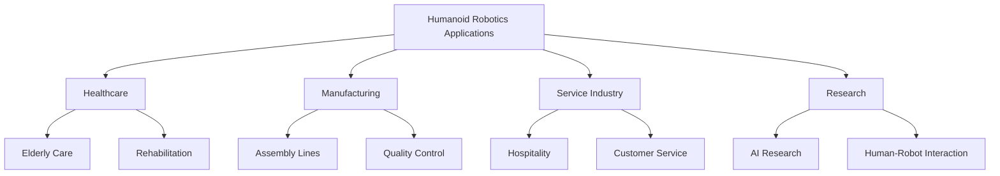

import ReadingTime from '@site/src/components/ReadingTime';
import PersonalizeButton from "@site/src/components/PersonalizeButton"

<PersonalizeButton/>

<h1 className="main-heading" id="introduction">Introduction to Physical AI & Humanoid Robotics</h1>
<div className="underline-class"></div>

<ReadingTime minutes={8} />

Welcome to the introduction module of the Physical AI & Humanoid Robotics textbook. This module will provide you with an overview of the field, its importance, and the foundational concepts you'll need to understand as you progress through the course.

<div className="border-line"></div>

---

<h2 className="second-heading" id="learning-objectives">
 Learning Objectives
</h2>
<div className="underline-class"></div>

By the end of this module, you will be able to:

- • **Define** Physical AI and its relationship to humanoid robotics
- • **Understand** the key components of a humanoid robot system
- • **Identify** the main challenges and opportunities in humanoid robotics
- • **Recognize** the interdisciplinary nature of Physical AI research
- • **Set up** your development environment for robotics programming
<div className="border-line"></div>

---

<h2 className="second-heading" id="prerequisites">
Prerequisites
</h2>
<div className="underline-class"></div>

Before starting this module, you should have:

| Requirement | Description |
|-------------|-------------|
| **Programming** | Basic understanding of Python |
| **Command Line** | Familiarity with Linux/Unix commands |
| **Mathematics** | Linear algebra and basic calculus |
| **Interest** | Passion for robotics and AI |
<div className="border-line"></div>

---

<h2 className="second-heading" id="module-overview">
Module Overview
</h2>
<div className="underline-class"></div>

This module covers the following topics:

<h3 className="third-heading" id="what-is-physical-ai">
What is Physical AI?
</h3>
<div className="underline-class"></div>

Physical AI represents the convergence of artificial intelligence with physical systems, enabling machines to interact with and navigate the real world.

:::info Key Concept
Physical AI combines perception, decision-making, and actuation to create intelligent embodied systems.
:::
<div className="border-line"></div>

<h3 className="third-heading" id="humanoid-robotics-intro">
Introduction to Humanoid Robotics
</h3>
<div className="underline-class"></div>

Humanoid robots are machines designed to replicate human form and function, combining mechanical engineering, AI, and sensor technology.

**Key characteristics:**
- ◦ Bipedal locomotion
- ◦ Human-like morphology
- ◦ Advanced sensory systems
- ◦ Adaptive behavior
<div className="border-line"></div>

<h3 className="third-heading" id="key-technologies">
Key Technologies and Components
</h3>

<div className="underline-class"></div>

<h4 className="fourth-heading" id="hardware-components">
Hardware Components
</h4>

<div className="underline-class"></div>

- ➤ **Sensors**
  - ▸ Vision systems (RGB, depth cameras)
  - ▸ LiDAR for spatial mapping
  - ▸ IMUs for balance and orientation
  - ▸ Force/torque sensors

- ➤ **Actuators**
  - ▸ Electric motors
  - ▸ Hydraulic systems
  - ▸ Pneumatic actuators
  - ▸ Soft robotics

<div className="border-line"></div>

<h4 className="fourth-heading" id="software-components">
Software Components
</h4>
<div className="underline-class"></div>

- ➤ **Perception Systems**
  - ▸ Computer vision
  - ▸ Object detection and tracking
  - ▸ Depth estimation

- ➤ **Control Systems**
  - ▸ Real-time processing
  - ▸ Feedback control loops
  - ▸ Motion planning

- ➤ **AI Models**
  - ▸ Deep learning for perception
  - ▸ Reinforcement learning for control
  - ▸ Natural language processing
<div className="border-line"></div>

<h3 className="third-heading" id="applications">
Applications and Use Cases
</h3>
<div className="underline-class"></div>


**Real-world applications:**

<h4 className="fourth-heading" id="healthcare">
1. Healthcare & Elderly Care
</h4>
<div className="underline-class"></div>

- • Patient assistance
- • Physical therapy support
- • Companionship for seniors

<h4 className="fourth-heading" id="manufacturing">
2. Manufacturing & Industrial Automation
</h4>
<div className="underline-class"></div>

- • Flexible assembly tasks
- • Quality inspection
- • Dangerous environment operations

<h4 className="fourth-heading" id="service">
3. Service & Hospitality
</h4>
<div className="underline-class"></div>

- • Reception and guidance
- • Food service
- • Cleaning and maintenance

<h4 className="fourth-heading" id="research">
4. Research & Education
</h4>
<div className="underline-class"></div>

- • Human-robot interaction studies
- • Educational demonstrations
- • AI algorithm development

<h4 className="fourth-heading" id="disaster-response">
5. Disaster Response & Rescue
</h4>
<div className="underline-class"></div>

- • Search and rescue operations
- • Hazardous material handling
- • Infrastructure inspection
<div className="border-line"></div>

<h3 className="third-heading" id="dev-setup">
Development Environment Setup
</h3>
<div className="underline-class"></div>

:::tip Getting Started
We'll guide you through setting up your robotics development environment step-by-step.
:::
<div className="border-line"></div>

**Required tools:**

```bash
# Install ROS (Robot Operating System)
sudo apt update
sudo apt install ros-noetic-desktop-full

# Set up Python environment
python3 -m venv robotics-env
source robotics-env/bin/activate
pip install numpy scipy matplotlib

# Install simulation tools
sudo apt install gazebo11
```

**Recommended IDEs:**
- • VS Code with Python and ROS extensions
- • PyCharm Professional
- • Jupyter Notebook for experiments
<div className="border-line"></div>

---

<h2 className="second-heading" id="what-youll-build">
What You'll Build
</h2>

<div className="underline-class"></div>

Throughout this course, you will:

✅ Learn fundamental robotics concepts
✅ Work with simulation tools (Gazebo, MuJoCo)
✅ Develop control algorithms
✅ Implement AI models for robot perception
✅ Create a complete humanoid robot project
<div className="border-line"></div>

---

<h2 className="second-heading" id="learning-path">
Learning Path
</h2>
<div className="underline-class"></div>


<div className="border-line"></div>

---

<h2 className="second-heading" id="tips">
Tips for Success
</h2>
<div className="underline-class"></div>

:::tip Study Strategies
- • Practice coding examples regularly
- • Build small projects as you learn
- • Join robotics communities online
- • Experiment with simulations
:::

:::warning Common Pitfalls
- • Don't skip the mathematics fundamentals
- • Always test in simulation before hardware
- • Version control your code from day one
:::
<div className="border-line"></div>

---

<h2 className="second-heading" id="resources">
Additional Resources
</h2>
<div className="underline-class"></div>

- • [ROS Documentation](https://docs.ros.org/)
- • [OpenAI Robotics Research](https://openai.com/research/robotics)
- • [IEEE Robotics & Automation Society](https://www.ieee-ras.org/)

---

<h2 className="second-heading" id="assessment">
Assessment
</h2>
<div className="underline-class"></div>

Test your understanding with these questions:

- 1. What is Physical AI and how does it differ from traditional AI?
- 2. Name three key components of a humanoid robot system
- 3. What are the main challenges in humanoid robotics today?
<div className="border-line"></div>

---

<h2 className="second-heading" id="next-steps">
Next Steps
</h2>
<div className="underline-class"></div>

Ready to dive deeper? Continue to the next section:

👉 [What is Physical AI?](./01-welcome.md)
<div className="border-line"></div>

---

<div style={{textAlign: 'center', marginTop: '40px', padding: '20px', background: 'var(--color-background-card-example)', borderRadius: '12px'}}>
  <h3 style={{color: 'var(--color-accent)'}}>Questions or Feedback?</h3>
  <p>Feel free to reach out through the course forum or office hours!</p>
</div>
