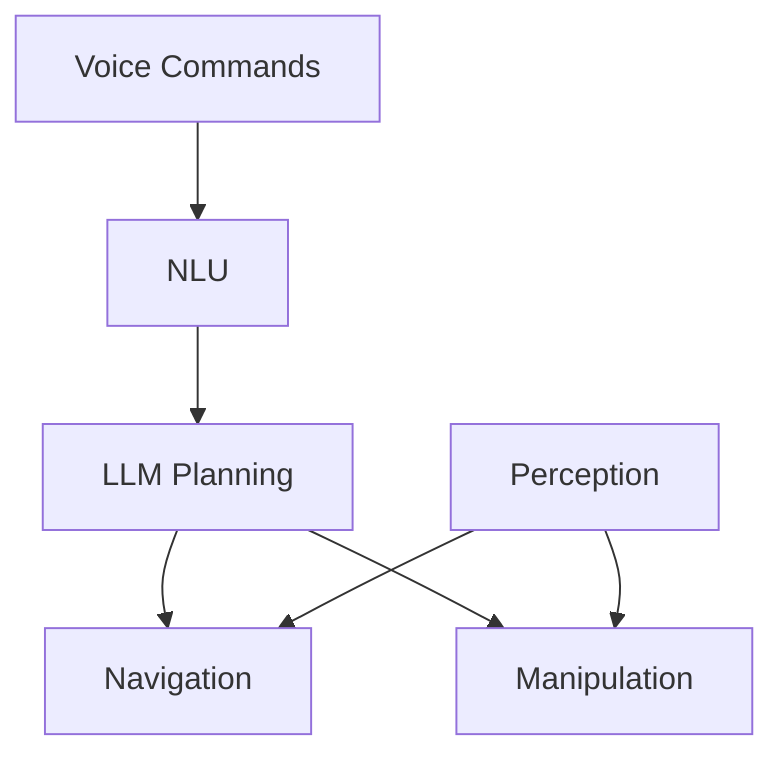

import ReadingTime from '@site/src/components/ReadingTime';
import ViewToggle from '@site/src/components/ViewToggle';

<ReadingTime minutes={15} />

<h1 className="main-heading">Capstone Project Overview</h1>
<div className="underline-class"></div>

<div className="full-content">

<div className="border-line"></div>

<h2 className="second-heading">Learning Objectives</h2>
<div className="underline-class"></div>

- Understand capstone project scope and objectives
- Identify key components and subsystems
- Plan development and integration phases
- Establish success criteria and metrics
- Coordinate voice, navigation, and manipulation systems

<div className="border-line"></div>

<h2 className="second-heading">Introduction</h2>
<div className="underline-class"></div>

Capstone project integrates all Physical AI & Humanoid Robotics concepts into a complete humanoid robot system using Vision-Language-Action (VLA) paradigm. System receives voice commands, interprets environment, plans actions, and executes with precision.

<div className="border-line"></div>

<h2 className="second-heading">Project Requirements</h2>
<div className="underline-class"></div>

<h3 className="third-heading">Functional Requirements</h3>
<div className="underline-class"></div>

**Voice Command Processing**
- Natural language understanding for multi-step commands
- Context-aware dialogue management
- LLM integration for planning

**Autonomous Navigation**
- Safe navigation in dynamic environments
- Path planning with obstacle avoidance
- Real-time localization and mapping

**Object Manipulation**
- Precise manipulation of various objects
- Object recognition and pose estimation
- Safe human interaction

**System Integration**
- Real-time coordination between subsystems
- Error handling and recovery
- Safety systems

<div className="border-line"></div>

<h3 className="third-heading">Technical Requirements</h3>
<div className="underline-class"></div>

**Hardware**: 18+ DOF humanoid, RGB-D camera, microphone array, tactile sensors, IMU

**Software**: ROS 2, Isaac Sim, Isaac ROS, modular design

**Performance**: Response < 2s, Navigation < 5cm error, Manipulation > 85% success, Uptime > 95%

<div className="border-line"></div>

<h2 className="second-heading">System Architecture</h2>
<div className="underline-class"></div>

<h3 className="third-heading">High-Level Architecture</h3>
<div className="underline-class"></div>



<div className="border-line"></div>

<h3 className="third-heading">Component Integration</h3>
<div className="underline-class"></div>

**Communication**: ROS 2 topics, action services, parameter server

**Data Flow**: Real-time streaming, buffer management, QoS settings

**Safety**: Error detection, graceful degradation, emergency stop

<div className="border-line"></div>

<h2 className="second-heading">Voice System Integration</h2>
<div className="underline-class"></div>

<h3 className="third-heading">NLP Pipeline</h3>
<div className="underline-class"></div>

```python
class VoiceSystemIntegrator:
    def __init__(self):
        rospy.init_node('voice_system')
        self.recognizer = sr.Recognizer()
        self.nlp_pipeline = pipeline("text-classification")
        
    def process_voice_command(self, audio):
        text = self.speech_to_text(audio)
        nlu_result = self.understand(text)
        task = self.plan_task(nlu_result)
        self.execute(task)
```

<div className="border-line"></div>

<h3 className="third-heading">Dialogue Management</h3>
<div className="underline-class"></div>

```python
class DialogueManager:
    def __init__(self):
        self.context = {'current_task': None, 'history': []}
        
    def process_input(self, user_input):
        if self.is_continuation(user_input):
            return self.continue_task(user_input)
        return self.start_new_task(user_input)
```

<div className="border-line"></div>

<h2 className="second-heading">Navigation System</h2>
<div className="underline-class"></div>

<h3 className="third-heading">Navigation Architecture</h3>
<div className="underline-class"></div>

```python
class NavigationSystemIntegrator:
    def __init__(self):
        self.global_planner = GlobalPlanner()
        self.local_planner = LocalPlanner()
        self.safety_monitor = SafetyMonitor()
        
    def navigate_to_pose(self, target):
        if not self.is_reachable(target):
            return False
        path = self.global_planner.plan(target)
        return self.follow_path(path)
```

<div className="border-line"></div>

<h2 className="second-heading">Manipulation System</h2>
<div className="underline-class"></div>

<h3 className="third-heading">Manipulation Architecture</h3>
<div className="underline-class"></div>

```python
class ManipulationSystemIntegrator:
    def __init__(self):
        self.ik_solver = InverseKinematicsSolver()
        self.gripper = GripperController()
        
    def grasp_object(self, obj_info):
        approach = self.calc_approach(obj_info)
        grasp = self.calc_grasp(obj_info)
        self.move_to_pose(approach)
        self.execute_grasp(grasp, obj_info)
        return self.verify_grasp()
```

<div className="border-line"></div>

<h2 className="second-heading">Integration Challenges</h2>
<div className="underline-class"></div>

<h3 className="third-heading">Real-Time Performance</h3>
<div className="underline-class"></div>

**Timing**: Perception < 50ms, Planning < 200ms, Control 50-100Hz

**Resources**: CPU/GPU allocation, memory management, I/O bandwidth

<div className="border-line"></div>

<h3 className="third-heading">Safety & Reliability</h3>
<div className="underline-class"></div>

**Safety**: Emergency stop, collision avoidance, force limiting

**Reliability**: Component monitoring, error recovery, health reporting

<div className="border-line"></div>

<h3 className="third-heading">Testing</h3>
<div className="underline-class"></div>

**Unit**: Component functionality, interface compatibility

**Integration**: End-to-end functionality, stress testing

**System**: Real-world scenarios, long-duration operation

<div className="border-line"></div>

<h2 className="second-heading">Success Criteria</h2>
<div className="underline-class"></div>

<h3 className="third-heading">Functional Metrics</h3>
<div className="underline-class"></div>

**Task Completion**: Command success rate, task completion time

**Navigation**: Path efficiency, obstacle avoidance, localization accuracy

**Manipulation**: Grasp success rate, placement accuracy

**Interaction**: NLU accuracy, dialogue coherence

<div className="border-line"></div>

<h3 className="third-heading">Technical Metrics</h3>
<div className="underline-class"></div>

**Performance**: Real-time compliance, resource utilization, latency, uptime

**Robustness**: Failure rate, recovery time, stress performance

<div className="border-line"></div>

<h2 className="second-heading">Project Timeline</h2>
<div className="underline-class"></div>

<h3 className="third-heading">Phase 1: Component Development (Weeks 1-4)</h3>
<div className="underline-class"></div>

Implement and test individual subsystems

<div className="border-line"></div>

<h3 className="third-heading">Phase 2: Subsystem Integration (Weeks 5-8)</h3>
<div className="underline-class"></div>

Integrate voice, navigation, and manipulation

<div className="border-line"></div>

<h3 className="third-heading">Phase 3: Full Integration (Weeks 9-12)</h3>
<div className="underline-class"></div>

Complete system integration with safety features

<div className="border-line"></div>

<h3 className="third-heading">Phase 4: Validation (Weeks 13-16)</h3>
<div className="underline-class"></div>

Optimization, validation, and documentation

<div className="border-line"></div>

<h2 className="second-heading">Summary</h2>
<div className="underline-class"></div>

Capstone project integrates voice processing, navigation, and manipulation into unified VLA system. Modular architecture enables systematic development and testing. Success requires attention to system architecture, real-time performance, safety, and comprehensive testing.

<div className="border-line"></div>

<h2 className="second-heading">Exercises</h2>
<div className="underline-class"></div>

1. Design high-level architecture
2. Create timeline with milestones
3. Identify integration challenges
4. Plan testing approach
5. Establish success metrics

<div className="border-line"></div>

<h2 className="second-heading">Further Reading</h2>
<div className="underline-class"></div>

- "Humanoid Robotics: A Reference" by Venture et al.
- "Robotics, Vision and Control" by Corke
- "Probabilistic Robotics" by Thrun et al.
- "Springer Handbook of Robotics" by Siciliano and Khatib

</div>