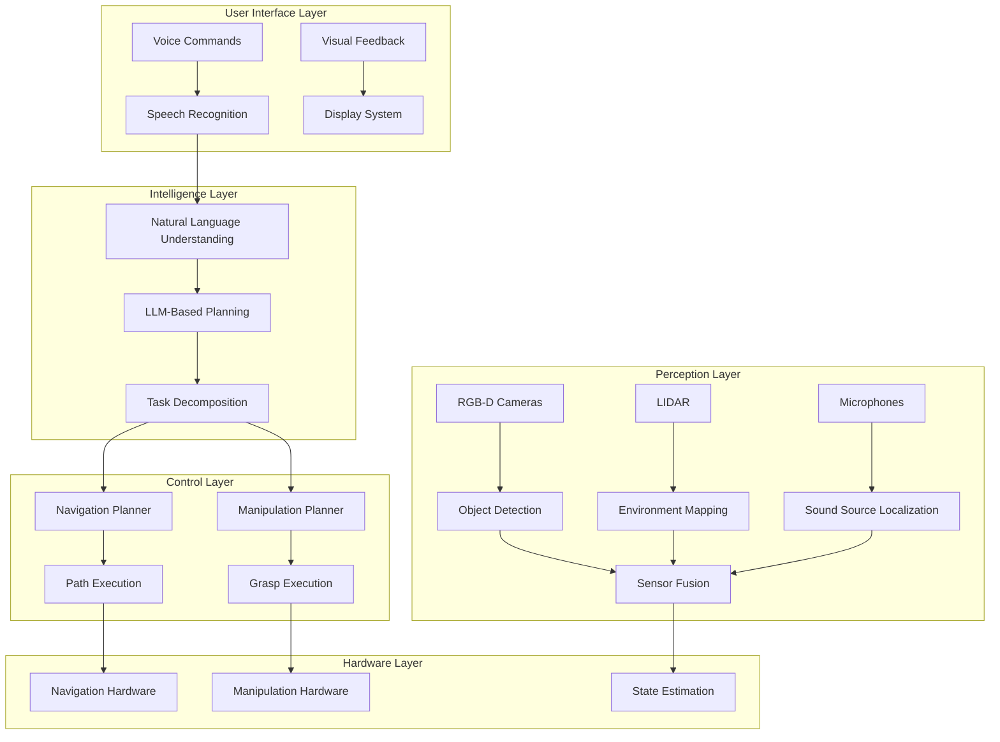

import ReadingTime from '@site/src/components/ReadingTime';
import ViewToggle from '@site/src/components/ViewToggle';

<ReadingTime minutes={54} />

<!-- <ViewToggle /> -->

<h1 className="main-heading">Capstone Project Overview</h1>
<div className="underline-class"></div>

<div className="full-content">

<div className="border-line"></div>
---

<h2 className="second-heading">
 Learning Objectives
</h2>
<div className="underline-class"></div>

After completing this chapter, you will be able to:
- • Understand the scope and objectives of the humanoid robotics capstone project
- • Identify the key components and subsystems that must be integrated
- • Plan the development and integration phases of the capstone project
- • Establish success criteria and evaluation metrics for the project
- • Coordinate the implementation of voice, navigation, and manipulation systems

<div className="border-line"></div>
---

<h2 className="second-heading">
 Introduction to the Capstone Project
</h2>
<div className="underline-class"></div>

The capstone project represents the culmination of the Physical AI & Humanoid Robotics Textbook, bringing together all the concepts, techniques, and technologies covered throughout the previous modules into a comprehensive, integrated humanoid robot system. This project challenges students to design, implement, and deploy a sophisticated humanoid robot capable of understanding natural language commands, navigating complex environments, manipulating objects, and interacting with humans in a meaningful way.

The capstone project is structured around the Vision-Language-Action (VLA) paradigm, integrating the multimodal perception, natural language understanding, and robotic action execution capabilities developed in the previous modules. Students will create a complete robotic system that can receive voice commands, interpret them in the context of its environment, plan appropriate actions, and execute those actions with precision and safety.

This chapter provides a comprehensive overview of the project, establishing the foundation for the subsequent implementation phases and ensuring that all components work together harmoniously to create an intelligent, capable humanoid robot.

<div className="border-line"></div>
---

<h2 className="second-heading">
 Project Scope and Requirements
</h2>
<div className="underline-class"></div>

<h3 className="third-heading">
- Functional Requirements
</h3>
<div className="underline-class"></div>

The capstone project must deliver a humanoid robot system with the following core capabilities:

**Voice Command Processing**
- • Natural language understanding for complex, multi-step commands
- • Context-aware dialogue management with clarification capabilities
- • Integration with large language models for high-level planning
- • Robust speech recognition in various acoustic environments

**Autonomous Navigation**
- • Safe navigation in dynamic environments with moving obstacles
- • Path planning that considers robot kinematics and environmental constraints
- • Localization and mapping in previously unknown environments
- • Integration with perception systems for real-time obstacle avoidance

**Object Manipulation**
- • Precise manipulation of various objects with different shapes, sizes, and weights
- • Integration with perception systems for object recognition and pose estimation
- • Grasp planning that considers object properties and task requirements
- • Safe interaction with humans and delicate objects

**System Integration**
- • Real-time coordination between all subsystems
- • Robust error handling and recovery mechanisms
- • Performance monitoring and logging
- • Safety systems that prevent harm to humans and environment

<h3 className="third-heading">
- Technical Requirements
</h3>
<div className="underline-class"></div>

**Hardware Platform**
- • Humanoid robot with at least 18 degrees of freedom
- • RGB-D camera system for perception
- • Microphone array for speech input
- • Tactile sensors for manipulation feedback
- • IMU and encoders for state estimation

**Software Architecture**
- • ROS 2-based system architecture
- • Isaac Sim for simulation and testing
- • Isaac ROS for perception and manipulation
- • Real-time operating system capabilities
- • Modular design with well-defined interfaces

**Performance Specifications**
- • Response time: < 2 seconds for command interpretation
- • Navigation accuracy: < 5cm positional error
- • Manipulation success rate: > 85% for standard objects
- • System uptime: > 95% during operation
- • Battery life: > 2 hours continuous operation

<div className="border-line"></div>
---

<h2 className="second-heading">
 System Architecture Overview
</h2>
<div className="underline-class"></div>

<h3 className="third-heading">
- High-Level Architecture
</h3>
<div className="underline-class"></div>

The capstone project follows a hierarchical architecture that separates concerns while enabling tight integration between subsystems:



<h3 className="third-heading">
- Component Integration
</h3>
<div className="underline-class"></div>

The system is designed with clear interfaces between components to enable modular development and testing:

**Communication Protocols**
- • ROS 2 topics for sensor data and commands
- • Action services for long-running tasks
- • Services for synchronous queries
- • Parameter server for configuration

**Data Flow Management**
- • Real-time data streaming between components
- • Buffer management for temporal synchronization
- • Quality of service settings for critical data
- • Data logging for debugging and analysis

**Safety and Error Handling**
- • Component-level error detection and reporting
- • Graceful degradation when subsystems fail
- • Emergency stop mechanisms
- • Safe state recovery procedures

</div>

<div className="border-line"></div>
---

<h2 className="second-heading">
 Voice System Integration
</h2>
<div className="underline-class"></div>

<h3 className="third-heading">
- Natural Language Processing Pipeline
</h3>
<div className="underline-class"></div>

The voice system creates the primary interface between users and the robot, requiring sophisticated natural language processing capabilities:

```python
# Example: Voice system integration architecture
import rospy
import actionlib
from std_msgs.msg import String
from sensor_msgs.msg import Image
from geometry_msgs.msg import PoseStamped
from humanoid_robot_msgs.msg import *
import speech_recognition as sr
import nltk
from transformers import pipeline

class VoiceSystemIntegrator:
    def __init__(self):
        # Initialize ROS components
        rospy.init_node('voice_system_integrator')

        # Publishers and subscribers
        self.speech_pub = rospy.Publisher('/speech_to_text', String, queue_size=10)
        self.text_to_speech_pub = rospy.Publisher('/text_to_speech', String, queue_size=10)
        self.command_pub = rospy.Publisher('/robot_commands', RobotCommand, queue_size=10)

        # Action clients
        self.nav_client = actionlib.SimpleActionClient('move_base', MoveBaseAction)
        self.manip_client = actionlib.SimpleActionClient('manipulation_server', ManipulationAction)

        # Initialize voice recognition
        self.recognizer = sr.Recognizer()
        self.microphone = sr.Microphone()

        # Initialize NLP components
        self.nlp_pipeline = self.initialize_nlp_pipeline()

        # Initialize dialogue manager
        self.dialogue_manager = DialogueManager()

        rospy.loginfo("Voice system integrator initialized")

    def initialize_nlp_pipeline(self):
        """Initialize natural language processing pipeline"""
        return {
            'tokenization': nltk.tokenize,
            'pos_tagging': nltk.pos_tag,
            'ner': nltk.ne_chunk,
            'intent_classification': pipeline("text-classification",
                                            model="microsoft/DialoGPT-medium"),
            'dependency_parsing': self.dependency_parser
        }

    def process_voice_command(self, audio_data):
        """Process voice command through full pipeline"""
        # Step 1: Speech recognition
        text = self.speech_to_text(audio_data)

        # Step 2: Natural language understanding
        nlu_result = self.natural_language_understanding(text)

        # Step 3: Task planning
        task_plan = self.plan_task(nlu_result)

        # Step 4: Execute or delegate to appropriate subsystem
        self.execute_or_delegate(task_plan)

    def speech_to_text(self, audio_data):
        """Convert audio to text using robust recognition"""
        try:
            # Apply audio preprocessing
            processed_audio = self.preprocess_audio(audio_data)

            # Perform recognition
            text = self.recognizer.recognize_google(processed_audio)
            return text
        except sr.UnknownValueError:
            rospy.logwarn("Speech recognition could not understand audio")
            return ""
        except sr.RequestError as e:
            rospy.logerr(f"Could not request results from speech recognition service; {e}")
            return ""

    def natural_language_understanding(self, text):
        """Parse and understand natural language command"""
        # Tokenize and tag parts of speech
        tokens = self.nlp_pipeline['tokenization'].word_tokenize(text)
        pos_tags = self.nlp_pipeline['pos_tagging'](tokens)

        # Extract named entities
        entities = self.nlp_pipeline['ner'](pos_tags)

        # Classify intent
        intent_result = self.nlp_pipeline['intent_classification'](text)

        # Parse dependencies
        dependencies = self.nlp_pipeline['dependency_parsing'](pos_tags)

        return {
            'text': text,
            'tokens': tokens,
            'pos_tags': pos_tags,
            'entities': entities,
            'intent': intent_result,
            'dependencies': dependencies
        }

    def plan_task(self, nlu_result):
        """Plan robot actions based on NLU result"""
        intent = nlu_result['intent']['label']
        entities = nlu_result['entities']

        if intent in ['navigation', 'go_to', 'move_to']:
            return self.plan_navigation(entities)
        elif intent in ['manipulation', 'grasp', 'pick_up', 'take']:
            return self.plan_manipulation(entities)
        elif intent in ['communication', 'speak', 'tell']:
            return self.plan_communication(entities)
        else:
            return self.plan_generic_task(intent, entities)

    def execute_or_delegate(self, task_plan):
        """Execute task or delegate to appropriate subsystem"""
        task_type = task_plan['type']

        if task_type == 'navigation':
            self.execute_navigation(task_plan)
        elif task_type == 'manipulation':
            self.execute_manipulation(task_plan)
        elif task_type == 'communication':
            self.execute_communication(task_plan)
        else:
            self.execute_generic_task(task_plan)
```

<h3 className="third-heading">
- Context-Aware Dialogue Management
</h3>
<div className="underline-class"></div>

The dialogue system maintains context and handles multi-turn conversations:

```python
# Example: Context-aware dialogue manager
class DialogueManager:
    def __init__(self):
        self.context = {
            'current_task': None,
            'user_preferences': {},
            'environment_state': {},
            'robot_state': {},
            'conversation_history': []
        }

        self.task_queue = []
        self.active_tasks = []

    def process_user_input(self, user_input):
        """Process user input in context of ongoing conversation"""
        # Update context with new input
        self.context['conversation_history'].append({
            'speaker': 'user',
            'text': user_input,
            'timestamp': rospy.get_time()
        })

        # Determine if input continues current task or starts new one
        if self.is_continuation(user_input):
            return self.continue_current_task(user_input)
        else:
            return self.start_new_task(user_input)

    def is_continuation(self, user_input):
        """Determine if user input continues current task"""
        current_task = self.context['current_task']
        if not current_task:
            return False

        # Check for continuation indicators
        continuation_indicators = ['more', 'continue', 'keep', 'then', 'next', 'after']
        return any(indicator in user_input.lower() for indicator in continuation_indicators)

    def continue_current_task(self, user_input):
        """Continue execution of current task based on new input"""
        current_task = self.context['current_task']

        # Update task parameters based on new input
        updated_task = self.update_task_with_input(current_task, user_input)

        # Return updated task for execution
        return updated_task

    def start_new_task(self, user_input):
        """Start a new task based on user input"""
        # Parse new task from input
        new_task = self.parse_task_from_input(user_input)

        # Set as current task
        self.context['current_task'] = new_task

        return new_task

    def update_task_with_input(self, current_task, user_input):
        """Update existing task with new information from user"""
        # This would involve complex natural language understanding
        # to determine what aspects of the task to update
        updated_task = current_task.copy()

        # Example: Update navigation destination
        if 'navigation' in current_task['type'] and 'to the' in user_input:
            new_location = self.extract_location(user_input)
            if new_location:
                updated_task['destination'] = new_location

        return updated_task

    def parse_task_from_input(self, user_input):
        """Parse complete task from user input"""
        # This would use the NLP pipeline to extract task information
        # For this example, we'll return a basic task structure
        return {
            'type': self.determine_task_type(user_input),
            'parameters': self.extract_task_parameters(user_input),
            'priority': self.determine_priority(user_input),
            'deadline': rospy.get_time() + 300  # 5 minutes default
        }
```

<div className="border-line"></div>
---

<h2 className="second-heading">
 Navigation System Integration
</h2>
<div className="underline-class"></div>

<h3 className="third-heading">
- Autonomous Navigation Architecture
</h3>
<div className="underline-class"></div>

The navigation system provides the robot's mobility capabilities, enabling it to move safely through complex environments:

```python
# Example: Navigation system integration
class NavigationSystemIntegrator:
    def __init__(self):
        # Initialize navigation components
        self.global_planner = GlobalPlanner()
        self.local_planner = LocalPlanner()
        self.costmap_2d = Costmap2D()
        self.transform_listener = tf.TransformListener()

        # Initialize perception integration
        self.perception_client = PerceptionClient()

        # Initialize safety systems
        self.safety_monitor = SafetyMonitor()

        rospy.loginfo("Navigation system integrator initialized")

    def navigate_to_pose(self, target_pose):
        """Navigate robot to specified pose with safety considerations"""
        # Verify target is reachable
        if not self.is_pose_reachable(target_pose):
            rospy.logerr("Target pose is not reachable")
            return False

        # Plan global path
        global_path = self.global_planner.plan_path(target_pose)
        if not global_path:
            rospy.logerr("Could not plan global path to target")
            return False

        # Execute path following with local planning
        success = self.follow_path(global_path, target_pose)

        return success

    def is_pose_reachable(self, pose):
        """Check if target pose is reachable considering robot constraints"""
        # Check if pose is in costmap bounds
        if not self.costmap_2d.is_in_bounds(pose.position.x, pose.position.y):
            return False

        # Check if pose is in free space
        cost = self.costmap_2d.get_cost_at_point(pose.position.x, pose.position.y)
        if cost >= costmap_2d.LETHAL_OBSTACLE:
            return False

        # Check for kinematic constraints
        if self.is_kinematically_feasible(pose):
            return True

        return False

    def follow_path(self, global_path, target_pose):
        """Follow planned path to target pose"""
        rate = rospy.Rate(10)  # 10 Hz control loop

        for path_point in global_path:
            # Get robot's current state
            current_pose = self.get_robot_pose()

            # Plan local trajectory to next path point
            local_plan = self.local_planner.plan_to_pose(path_point, current_pose)

            # Execute local plan with obstacle avoidance
            success = self.execute_local_plan(local_plan)

            if not success:
                rospy.logwarn("Local plan execution failed, replanning...")
                return False

            # Check safety constraints
            if not self.safety_monitor.is_safe():
                rospy.logerr("Safety constraint violated, stopping navigation")
                return False

            rate.sleep()

        # Final approach to target
        return self.final_approach(target_pose)

    def execute_local_plan(self, local_plan):
        """Execute local navigation plan with obstacle detection"""
        # Convert plan to velocity commands
        velocity_cmd = self.plan_to_velocity(local_plan)

        # Check for obstacles in path
        obstacles = self.perception_client.detect_obstacles_in_path(local_plan)
        if obstacles:
            # Handle obstacle avoidance
            return self.handle_obstacle_avoidance(obstacles, local_plan)

        # Execute velocity command
        self.publish_velocity_command(velocity_cmd)
        return True
```

<div className="border-line"></div>
---

<h2 className="second-heading">
 Manipulation System Integration
</h2>
<div className="underline-class"></div>

<h3 className="third-heading">
- Object Manipulation Architecture
</h3>
<div className="underline-class"></div>

The manipulation system enables the robot to interact with objects in its environment:

```python
# Example: Manipulation system integration
class ManipulationSystemIntegrator:
    def __init__(self):
        # Initialize manipulation components
        self.ik_solver = InverseKinematicsSolver()
        self.motion_planner = MotionPlanner()
        self.gripper_controller = GripperController()

        # Initialize perception integration
        self.object_detector = ObjectDetector()

        # Initialize force control
        self.force_controller = ForceController()

        rospy.loginfo("Manipulation system integrator initialized")

    def grasp_object(self, object_info):
        """Grasp specified object with appropriate grasp strategy"""
        # Plan approach trajectory
        approach_pose = self.calculate_approach_pose(object_info)
        grasp_pose = self.calculate_grasp_pose(object_info)

        # Execute approach
        success = self.move_to_pose(approach_pose)
        if not success:
            rospy.logerr("Failed to reach approach pose")
            return False

        # Execute grasp
        success = self.execute_grasp(grasp_pose, object_info)
        if not success:
            rospy.logerr("Grasp execution failed")
            return False

        # Lift object
        success = self.lift_object(object_info)
        if not success:
            rospy.logerr("Object lift failed")
            return False

        return True

    def calculate_approach_pose(self, object_info):
        """Calculate safe approach pose for object grasping"""
        object_pose = object_info['pose']
        object_size = object_info['size']

        # Calculate approach offset based on object size and gripper
        approach_distance = 0.1  # 10cm from object surface

        # Calculate approach direction (usually from above for top grasps)
        approach_pose = Pose()
        approach_pose.position.x = object_pose.position.x
        approach_pose.position.y = object_pose.position.y
        approach_pose.position.z = object_pose.position.z + object_size.z/2 + approach_distance
        approach_pose.orientation = object_pose.orientation  # Match object orientation

        return approach_pose

    def calculate_grasp_pose(self, object_info):
        """Calculate optimal grasp pose for object"""
        object_pose = object_info['pose']
        object_shape = object_info['shape']

        # Select grasp strategy based on object properties
        if object_shape == 'cylinder':
            grasp_pose = self.calculate_cylinder_grasp(object_pose)
        elif object_shape == 'box':
            grasp_pose = self.calculate_box_grasp(object_pose)
        elif object_shape == 'sphere':
            grasp_pose = self.calculate_sphere_grasp(object_pose)
        else:
            grasp_pose = self.calculate_generic_grasp(object_pose)

        return grasp_pose

    def execute_grasp(self, grasp_pose, object_info):
        """Execute grasp at specified pose"""
        # Move to grasp pose
        success = self.move_to_pose(grasp_pose)
        if not success:
            return False

        # Close gripper with appropriate force
        object_weight = object_info.get('weight', 0.5)  # Default 0.5kg
        grasp_force = self.calculate_grasp_force(object_weight)

        self.gripper_controller.close_with_force(grasp_force)

        # Verify grasp success
        grasp_success = self.verify_grasp_success()
        return grasp_success

    def verify_grasp_success(self):
        """Verify that object was successfully grasped"""
        # Check tactile sensors
        tactile_data = self.gripper_controller.get_tactile_data()
        if not self.is_tactile_contact_detected(tactile_data):
            rospy.logwarn("No tactile contact detected during grasp")
            return False

        # Check force sensors
        force_data = self.gripper_controller.get_force_data()
        if not self.is_appropriate_force_detected(force_data):
            rospy.logwarn("Inappropriate force detected during grasp")
            return False

        # Check object tracking (if available)
        # This would use visual or other sensors to confirm object is held

        return True
```

## System Integration Challenges

### Real-Time Performance

Integrating multiple complex subsystems presents significant real-time performance challenges:

**Timing Constraints**
- Perception pipeline: < 50ms per frame
- Planning pipeline: < 200ms per plan
- Control loop: 50-100Hz minimum
- Communication: < 10ms latency between subsystems

**Resource Management**
- CPU allocation for each subsystem
- Memory management for large data structures
- GPU utilization for perception and planning
- I/O bandwidth for sensor data

### Safety and Reliability

The integrated system must maintain safety and reliability across all operational modes:

**Safety Systems**
- Emergency stop mechanisms
- Collision avoidance
- Force limiting
- Safe state recovery

**Reliability Features**
- Component monitoring
- Graceful degradation
- Error recovery
- System health reporting

### Testing and Validation

Comprehensive testing ensures all integrated components work together effectively:

**Unit Testing**
- Individual component functionality
- Interface compatibility
- Edge case handling
- Performance benchmarks

**Integration Testing**
- End-to-end functionality
- Stress testing
- Failure mode testing
- Safety system validation

**System Testing**
- Real-world scenario testing
- Long-duration operation
- Multi-user interaction
- Environmental robustness

## Success Criteria and Evaluation

### Functional Metrics

The project will be evaluated based on the following functional criteria:

**Task Completion Rate**
- Percentage of commands successfully executed
- Time to complete standard tasks
- Error recovery effectiveness

**Navigation Performance**
- Path efficiency (optimal vs. actual path length)
- Obstacle avoidance success rate
- Localization accuracy

**Manipulation Performance**
- Grasp success rate for various object types
- Placement accuracy
- Object handling safety

**Interaction Quality**
- Natural language understanding accuracy
- Dialogue coherence
- User satisfaction scores

### Technical Metrics

**System Performance**
- Real-time constraint compliance
- Resource utilization efficiency
- Communication latency
- System uptime

**Robustness**
- Failure rate under normal operation
- Recovery time from errors
- Performance degradation under stress
- Safety system response time

## Project Timeline and Milestones

### Phase 1: Component Development (Weeks 1-4)
- Implement individual subsystems (voice, navigation, manipulation)
- Unit test each component
- Establish basic functionality

### Phase 2: Subsystem Integration (Weeks 5-8)
- Integrate voice system with planning
- Connect navigation to perception
- Link manipulation to perception and planning

### Phase 3: Full System Integration (Weeks 9-12)
- Integrate all subsystems
- Implement system-level safety features
- Conduct comprehensive testing

### Phase 4: Validation and Optimization (Weeks 13-16)
- Performance optimization
- System validation in real scenarios
- Documentation and final testing

## Summary

The capstone project represents the integration of all concepts learned throughout the Physical AI & Humanoid Robotics Textbook into a comprehensive, functional humanoid robot system. The project challenges students to combine voice processing, navigation, and manipulation capabilities into a unified system that can understand natural language commands, navigate complex environments, and manipulate objects safely and effectively.

Success in the capstone project requires careful attention to system architecture, real-time performance, safety considerations, and comprehensive testing. The project serves as a practical demonstration of the Vision-Language-Action paradigm and provides students with hands-on experience in developing sophisticated robotic systems.

The project's modular architecture allows for systematic development and testing of individual components before full integration, ensuring that each subsystem functions correctly before being incorporated into the complete system. This approach minimizes integration risks and enables focused troubleshooting when issues arise.

## Exercises

1. Design the high-level architecture for your capstone project implementation
2. Create a detailed timeline with specific milestones and deliverables
3. Identify potential integration challenges and develop mitigation strategies
4. Plan the testing approach for your integrated system
5. Establish success metrics and evaluation criteria for your project

## Further Reading

- "Humanoid Robotics: A Reference" by Venture et al.
- "Robotics, Vision and Control" by Corke
- "Probabilistic Robotics" by Thrun et al.
- "Springer Handbook of Robotics" by Siciliano and Khatib