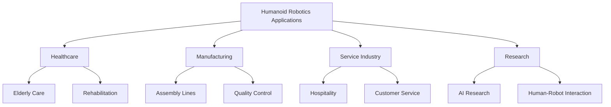
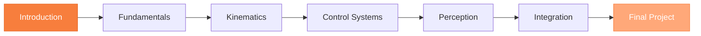

import ReadingTime from '@site/src/components/ReadingTime';
import PersonalizeButton from "@site/src/components/PersonalizeButton"

<PersonalizeButton/>

<h1 className="main-heading" id="introduction">भौतिक एआई और मानवरूपी रोबोटिक्स का परिचय</h1>
<div className="underline-class"></div>

<ReadingTime minutes={8} />

भौतिक एआई और मानवरूपी रोबोटिक्स पाठ्यपुस्तक के परिचय मॉड्यूल में आपका स्वागत है। यह मॉड्यूल आपको क्षेत्र का अवलोकन, इसका महत्व, और मूलभूत अवधारणाएं प्रदान करेगा जिन्हें आपको पाठ्यक्रम में आगे बढ़ने के लिए समझने की आवश्यकता होगी।

<div className="border-line"></div>

---

<h2 className="second-heading" id="learning-objectives">
 सीखने के उद्देश्य
</h2>
<div className="underline-class"></div>

इस मॉड्यूल के अंत तक, आप सक्षम होंगे:

- • **परिभाषित करें** भौतिक एआई और मानवरूपी रोबोटिक्स से इसका संबंध
- • **समझें** मानवरूपी रोबोट प्रणाली के प्रमुख घटक
- • **पहचानें** मानवरूपी रोबोटिक्स में मुख्य चुनौतियां और अवसर
- • **पहचानें** भौतिक एआई अनुसंधान की अंतःविषय प्रकृति
- • **सेट अप करें** रोबोटिक्स प्रोग्रामिंग के लिए अपना विकास वातावरण

<div className="border-line"></div>

---

<h2 className="second-heading" id="prerequisites">
पूर्वापेक्षाएँ
</h2>
<div className="underline-class"></div>

इस मॉड्यूल को शुरू करने से पहले, आपके पास होना चाहिए:

| आवश्यकता | विवरण |
|-------------|-------------|
| **प्रोग्रामिंग** | पायथन की बुनियादी समझ |
| **कमांड लाइन** | लिनक्स/यूनिक्स कमांड से परिचित |
| **गणित** | रैखिक बीजगणित और बुनियादी कैलकुलस |
| **रुचि** | रोबोटिक्स और एआई में जुनून |

<div className="border-line"></div>

---

<h2 className="second-heading" id="module-overview">
मॉड्यूल अवलोकन
</h2>
<div className="underline-class"></div>

यह मॉड्यूल निम्नलिखित विषयों को कवर करता है:

<h3 className="third-heading" id="what-is-physical-ai">
भौतिक एआई क्या है?
</h3>
<div className="underline-class"></div>

भौतिक एआई कृत्रिम बुद्धिमत्ता और भौतिक प्रणालियों के अभिसरण का प्रतिनिधित्व करता है, जो मशीनों को वास्तविक दुनिया के साथ बातचीत करने और नेविगेट करने में सक्षम बनाता है।

:::info प्रमुख अवधारणा
भौतिक एआई बुद्धिमान सन्निहित प्रणालियों को बनाने के लिए धारणा, निर्णय लेने और क्रियान्वयन को जोड़ता है।
:::

<div className="border-line"></div>

<h3 className="third-heading" id="humanoid-robotics-intro">
मानवरूपी रोबोटिक्स का परिचय
</h3>
<div className="underline-class"></div>

मानवरूपी रोबोट ऐसी मशीनें हैं जो मानव रूप और कार्य को दोहराने के लिए डिज़ाइन की गई हैं, जो यांत्रिक इंजीनियरिंग, एआई और सेंसर प्रौद्योगिकी को जोड़ती हैं।

**प्रमुख विशेषताएं:**
- ◦ द्विपाद गति
- ◦ मानव जैसी आकृति विज्ञान
- ◦ उन्नत संवेदी प्रणाली
- ◦ अनुकूली व्यवहार

<div className="border-line"></div>

<h3 className="third-heading" id="key-technologies">
प्रमुख प्रौद्योगिकियां और घटक
</h3>

<div className="underline-class"></div>

<h4 className="fourth-heading" id="hardware-components">
हार्डवेयर घटक
</h4>

<div className="underline-class"></div>

- ➤ **सेंसर**
  - ▸ विजन सिस्टम (RGB, गहराई कैमरे)
  - ▸ स्थानिक मैपिंग के लिए LiDAR
  - ▸ संतुलन और अभिविन्यास के लिए IMU
  - ▸ बल/टॉर्क सेंसर

- ➤ **एक्चुएटर**
  - ▸ इलेक्ट्रिक मोटर
  - ▸ हाइड्रोलिक सिस्टम
  - ▸ न्यूमेटिक एक्चुएटर
  - ▸ सॉफ्ट रोबोटिक्स

<div className="border-line"></div>

<h4 className="fourth-heading" id="software-components">
सॉफ्टवेयर घटक
</h4>
<div className="underline-class"></div>

- ➤ **धारणा प्रणाली**
  - ▸ कंप्यूटर विजन
  - ▸ वस्तु पहचान और ट्रैकिंग
  - ▸ गहराई अनुमान

- ➤ **नियंत्रण प्रणाली**
  - ▸ वास्तविक समय प्रसंस्करण
  - ▸ फीडबैक नियंत्रण लूप
  - ▸ गति योजना

- ➤ **एआई मॉडल**
  - ▸ धारणा के लिए डीप लर्निंग
  - ▸ नियंत्रण के लिए सुदृढीकरण अधिगम
  - ▸ प्राकृतिक भाषा प्रसंस्करण

<div className="border-line"></div>

<h3 className="third-heading" id="applications">
अनुप्रयोग और उपयोग के मामले
</h3>
<div className="underline-class"></div>


**वास्तविक दुनिया के अनुप्रयोग:**

<h4 className="fourth-heading" id="healthcare">
1. स्वास्थ्य सेवा और बुजुर्ग देखभाल
</h4>
<div className="underline-class"></div>

- • रोगी सहायता
- • भौतिक चिकित्सा समर्थन
- • वरिष्ठों के लिए साहचर्य

<h4 className="fourth-heading" id="manufacturing">
2. विनिर्माण और औद्योगिक स्वचालन
</h4>
<div className="underline-class"></div>

- • लचीली असेंबली कार्य
- • गुणवत्ता निरीक्षण
- • खतरनाक वातावरण संचालन

<h4 className="fourth-heading" id="service">
3. सेवा और आतिथ्य
</h4>
<div className="underline-class"></div>

- • स्वागत और मार्गदर्शन
- • खाद्य सेवा
- • सफाई और रखरखाव

<h4 className="fourth-heading" id="research">
4. अनुसंधान और शिक्षा
</h4>
<div className="underline-class"></div>

- • मानव-रोबोट संपर्क अध्ययन
- • शैक्षिक प्रदर्शन
- • एआई एल्गोरिथम विकास

<h4 className="fourth-heading" id="disaster-response">
5. आपदा प्रतिक्रिया और बचाव
</h4>
<div className="underline-class"></div>

- • खोज और बचाव संचालन
- • खतरनाक सामग्री संचालन
- • बुनियादी ढांचा निरीक्षण

<div className="border-line"></div>

<h3 className="third-heading" id="dev-setup">
विकास वातावरण सेटअप
</h3>
<div className="underline-class"></div>

:::tip शुरुआत करना
हम आपको चरण-दर-चरण आपके रोबोटिक्स विकास वातावरण को सेट करने में मार्गदर्शन करेंगे।
:::

<div className="border-line"></div>

**आवश्यक उपकरण:**
```bash
# ROS (Robot Operating System) इंस्टॉल करें
sudo apt update
sudo apt install ros-noetic-desktop-full

# पायथन वातावरण सेट अप करें
python3 -m venv robotics-env
source robotics-env/bin/activate
pip install numpy scipy matplotlib

# सिमुलेशन उपकरण इंस्टॉल करें
sudo apt install gazebo11
```

**अनुशंसित IDE:**
- • पायथन और ROS एक्सटेंशन के साथ VS Code
- • PyCharm Professional
- • प्रयोगों के लिए Jupyter Notebook

<div className="border-line"></div>

---

<h2 className="second-heading" id="what-youll-build">
आप क्या बनाएंगे
</h2>

<div className="underline-class"></div>

इस पाठ्यक्रम के दौरान, आप:

✅ मूलभूत रोबोटिक्स अवधारणाएं सीखेंगे
✅ सिमुलेशन उपकरणों (Gazebo, MuJoCo) के साथ काम करेंगे
✅ नियंत्रण एल्गोरिथम विकसित करेंगे
✅ रोबोट धारणा के लिए एआई मॉडल लागू करेंगे
✅ एक पूर्ण मानवरूपी रोबोट परियोजना बनाएंगे

<div className="border-line"></div>

---

<h2 className="second-heading" id="learning-path">
सीखने का पथ
</h2>
<div className="underline-class"></div>


<div className="border-line"></div>

---

<h2 className="second-heading" id="tips">
सफलता के लिए सुझाव
</h2>
<div className="underline-class"></div>

:::tip अध्ययन रणनीतियां
- • नियमित रूप से कोडिंग उदाहरणों का अभ्यास करें
- • सीखते समय छोटी परियोजनाएं बनाएं
- • ऑनलाइन रोबोटिक्स समुदायों में शामिल हों
- • सिमुलेशन के साथ प्रयोग करें
:::

:::warning सामान्य गलतियां
- • गणित की बुनियादी बातों को न छोड़ें
- • हार्डवेयर से पहले हमेशा सिमुलेशन में परीक्षण करें
- • पहले दिन से अपने कोड का संस्करण नियंत्रण करें
:::

<div className="border-line"></div>

---

<h2 className="second-heading" id="resources">
अतिरिक्त संसाधन
</h2>
<div className="underline-class"></div>

- • [ROS दस्तावेज़ीकरण](https://docs.ros.org/)
- • [OpenAI रोबोटिक्स अनुसंधान](https://openai.com/research/robotics)
- • [IEEE रोबोटिक्स और स्वचालन सोसायटी](https://www.ieee-ras.org/)

---

<h2 className="second-heading" id="assessment">
मूल्यांकन
</h2>
<div className="underline-class"></div>

इन प्रश्नों के साथ अपनी समझ का परीक्षण करें:

- 1. भौतिक एआई क्या है और यह पारंपरिक एआई से कैसे भिन्न है?
- 2. मानवरूपी रोबोट प्रणाली के तीन प्रमुख घटकों का नाम बताएं
- 3. आज मानवरूपी रोबोटिक्स में मुख्य चुनौतियां क्या हैं?

<div className="border-line"></div>

---

<h2 className="second-heading" id="next-steps">
अगले कदम
</h2>
<div className="underline-class"></div>

गहराई से जाने के लिए तैयार हैं? अगले अनुभाग पर जारी रखें:

👉 [भौतिक एआई क्या है?](./01-welcome.md)

<div className="border-line"></div>

---

<div style={{textAlign: 'center', marginTop: '40px', padding: '20px', background: 'var(--color-background-card-example)', borderRadius: '12px'}}>
  <h3 style={{color: 'var(--color-accent)'}}>प्रश्न या प्रतिक्रिया?</h3>
  <p>पाठ्यक्रम मंच या कार्यालय समय के माध्यम से बेझिझक संपर्क करें!</p>
</div>