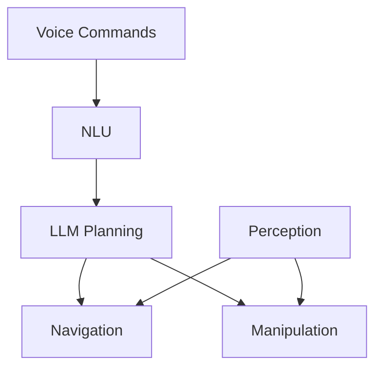

import ReadingTime from '@site/src/components/ReadingTime';
import ViewToggle from '@site/src/components/ViewToggle';

<ReadingTime minutes={15} />


<h1 className="main-heading">कैपस्टोन प्रोजेक्ट अवलोकन</h1>
<div className="underline-class"></div>

<div className="full-content">

<div className="border-line"></div>

<h2 className="second-heading">सीखने के उद्देश्य</h2>
<div className="underline-class"></div>

- कैपस्टोन प्रोजेक्ट के क्षेत्र और उद्देश्यों को समझना
- मुख्य घटकों और उपप्रणालियों की पहचान करना
- विकास और एकीकरण चरणों की योजना बनाना
- सफलता मानदंड और मेट्रिक्स स्थापित करना
- वॉइस, नेविगेशन और मैनिपुलेशन प्रणालियों को निर्देशित करना

<div className="border-line"></div>

<h2 className="second-heading">परिचय</h2>
<div className="underline-class"></div>

कैपस्टोन प्रोजेक्ट विजन-भाषा-एक्शन (VLA) पैराडाइम का उपयोग करके एक पूर्ण ह्यूमनॉइड रोबोट प्रणाली में सभी भौतिक AI और ह्यूमनॉइड रोबोटिक्स अवधारणाओं को एकीकृत करता है। प्रणाली वॉइस कमांड प्राप्त करती है, वातावरण की व्याख्या करती है, कार्यों की योजना बनाती है और सटीकता के साथ निष्पादित करती है।

<div className="border-line"></div>

<h2 className="second-heading">प्रोजेक्ट आवश्यकताएं</h2>
<div className="underline-class"></div>

<h3 className="third-heading">कार्यात्मक आवश्यकताएं</h3>
<div className="underline-class"></div>

**वॉइस कमांड प्रसंस्करण**
- बहु-चरणीय कमांड के लिए प्राकृतिक भाषा समझ
- संदर्भ-जागरूक संवाद प्रबंधन
- योजना के लिए LLM एकीकरण

**स्वायत्त नेविगेशन**
- गतिशील वातावरण में सुरक्षित नेविगेशन
- बाधा पहचान के साथ पाथ योजना
- रीयल-टाइम स्थानीयकरण और मैपिंग

**ऑब्जेक्ट मैनिपुलेशन**
- विभिन्न ऑब्जेक्ट का सटीक मैनिपुलेशन
- ऑब्जेक्ट पहचान और पोज अनुमान
- सुरक्षित मानव इंटरैक्शन

**सिस्टम एकीकरण**
- उपप्रणालियों के बीच रीयल-टाइम समन्वय
- त्रुटि निपटान और पुनर्प्राप्ति
- सुरक्षा प्रणालियां

<div className="border-line"></div>

<h3 className="third-heading">तकनीकी आवश्यकताएं</h3>
<div className="underline-class"></div>

**हार्डवेयर**: 18+ DOF ह्यूमनॉइड, RGB-D कैमरा, माइक्रोफोन एरे, स्पर्श सेंसर, IMU

**सॉफ्टवेयर**: ROS 2, Isaac Sim, Isaac ROS, मॉड्यूलर डिज़ाइन

**प्रदर्शन**: प्रतिक्रिया < 2s, नेविगेशन < 5cm त्रुटि, मैनिपुलेशन > 85% सफलता, अपटाइम > 95%

<div className="border-line"></div>

<h2 className="second-heading">सिस्टम वास्तुकला</h2>
<div className="underline-class"></div>

<h3 className="third-heading">उच्च-स्तरीय वास्तुकला</h3>
<div className="underline-class"></div>



<div className="border-line"></div>

<h3 className="third-heading">घटक एकीकरण</h3>
<div className="underline-class"></div>

**संचार**: ROS 2 विषय, एक्शन सेवाएं, पैरामीटर सर्वर

**डेटा प्रवाह**: रीयल-टाइम स्ट्रीमिंग, बफर प्रबंधन, QoS सेटिंग्स

**सुरक्षा**: त्रुटि पहचान, कृपालु अवनति, आपातकालीन रोक

<div className="border-line"></div>

<h2 className="second-heading">वॉइस सिस्टम एकीकरण</h2>
<div className="underline-class"></div>

<h3 className="third-heading">NLP पाइपलाइन</h3>
<div className="underline-class"></div>

```python
class VoiceSystemIntegrator:
    def __init__(self):
        rospy.init_node('voice_system')
        self.recognizer = sr.Recognizer()
        self.nlp_pipeline = pipeline("text-classification")

    def process_voice_command(self, audio):
        text = self.speech_to_text(audio)
        nlu_result = self.understand(text)
        task = self.plan_task(nlu_result)
        self.execute(task)
```

<div className="border-line"></div>

<h3 className="third-heading">संवाद प्रबंधन</h3>
<div className="underline-class"></div>

```python
class DialogueManager:
    def __init__(self):
        self.context = {'current_task': None, 'history': []}

    def process_input(self, user_input):
        if self.is_continuation(user_input):
            return self.continue_task(user_input)
        return self.start_new_task(user_input)
```

<div className="border-line"></div>

<h2 className="second-heading">नेविगेशन सिस्टम</h2>
<div className="underline-class"></div>

<h3 className="third-heading">नेविगेशन वास्तुकला</h3>
<div className="underline-class"></div>

```python
class NavigationSystemIntegrator:
    def __init__(self):
        self.global_planner = GlobalPlanner()
        self.local_planner = LocalPlanner()
        self.safety_monitor = SafetyMonitor()

    def navigate_to_pose(self, target):
        if not self.is_reachable(target):
            return False
        path = self.global_planner.plan(target)
        return self.follow_path(path)
```

<div className="border-line"></div>

<h2 className="second-heading">मैनिपुलेशन सिस्टम</h2>
<div className="underline-class"></div>

<h3 className="third-heading">मैनिपुलेशन वास्तुकला</h3>
<div className="underline-class"></div>

```python
class ManipulationSystemIntegrator:
    def __init__(self):
        self.ik_solver = InverseKinematicsSolver()
        self.gripper = GripperController()

    def grasp_object(self, obj_info):
        approach = self.calc_approach(obj_info)
        grasp = self.calc_grasp(obj_info)
        self.move_to_pose(approach)
        self.execute_grasp(grasp, obj_info)
        return self.verify_grasp()
```

<div className="border-line"></div>

<h2 className="second-heading">एकीकरण चुनौतियां</h2>
<div className="underline-class"></div>

<h3 className="third-heading">रीयल-टाइम प्रदर्शन</h3>
<div className="underline-class"></div>

**समय**: धारणा < 50ms, योजना < 200ms, नियंत्रण 50-100Hz

**संसाधन**: CPU/GPU आवंटन, मेमोरी प्रबंधन, I/O बैंडविड्थ

<div className="border-line"></div>

<h3 className="third-heading">सुरक्षा और विश्वसनीयता</h3>
<div className="underline-class"></div>

**सुरक्षा**: आपातकालीन रोक, टक्कर रोकथाम, बल सीमा

**विश्वसनीयता**: घटक निगरानी, त्रुटि पुनर्प्राप्ति, स्वास्थ्य रिपोर्टिंग

<div className="border-line"></div>

<h3 className="third-heading">परीक्षण</h3>
<div className="underline-class"></div>

**यूनिट**: घटक कार्यक्षमता, इंटरफेस संगतता

**एकीकरण**: एंड-टू-एंड कार्यक्षमता, तनाव परीक्षण

**सिस्टम**: वास्तविक दुनिया के परिदृश्य, लंबी अवधि का संचालन

<div className="border-line"></div>

<h2 className="second-heading">सफलता मानदंड</h2>
<div className="underline-class"></div>

<h3 className="third-heading">कार्यात्मक मेट्रिक्स</h3>
<div className="underline-class"></div>

**कार्य पूरा होना**: कमांड सफलता दर, कार्य पूरा होने का समय

**नेविगेशन**: पाथ दक्षता, बाधा पहचान, स्थानीयकरण सटीकता

**मैनिपुलेशन**: ग्रास्प सफलता दर, स्थान निर्धारण सटीकता

**इंटरैक्शन**: NLU सटीकता, संवाद सुसंगतता

<div className="border-line"></div>

<h3 className="third-heading">तकनीकी मेट्रिक्स</h3>
<div className="underline-class"></div>

**प्रदर्शन**: रीयल-टाइम अनुपालन, संसाधन उपयोग, विलंबता, अपटाइम

**दृढ़ता**: विफलता दर, पुनर्प्राप्ति समय, तनाव प्रदर्शन

<div className="border-line"></div>

<h2 className="second-heading">प्रोजेक्ट टाइमलाइन</h2>
<div className="underline-class"></div>

<h3 className="third-heading">चरण 1: घटक विकास (सप्ताह 1-4)</h3>
<div className="underline-class"></div>

व्यक्तिगत उपप्रणालियों को लागू करें और परीक्षण करें

<div className="border-line"></div>

<h3 className="third-heading">चरण 2: उपप्रणाली एकीकरण (सप्ताह 5-8)</h3>
<div className="underline-class"></div>

वॉइस, नेविगेशन और मैनिपुलेशन को एकीकृत करें

<div className="border-line"></div>

<h3 className="third-heading">चरण 3: पूर्ण एकीकरण (सप्ताह 9-12)</h3>
<div className="underline-class"></div>

सुरक्षा सुविधाओं के साथ पूर्ण प्रणाली एकीकरण

<div className="border-line"></div>

<h3 className="third-heading">चरण 4: मान्यकरण (सप्ताह 13-16)</h3>
<div className="underline-class"></div>

अनुकूलन, मान्यकरण और दस्तावेज़ीकरण

<div className="border-line"></div>

<h2 className="second-heading">सारांश</h2>
<div className="underline-class"></div>

कैपस्टोन प्रोजेक्ट एकीकृत VLA प्रणाली में वॉइस प्रसंस्करण, नेविगेशन और मैनिपुलेशन को एकीकृत करता है। मॉड्यूलर वास्तुकला व्यवस्थित विकास और परीक्षण को सक्षम बनाती है। सफलता के लिए सिस्टम वास्तुकला, रीयल-टाइम प्रदर्शन, सुरक्षा और व्यापक परीक्षण पर ध्यान देने की आवश्यकता होती है।

<div className="border-line"></div>

<h2 className="second-heading">अभ्यास</h2>
<div className="underline-class"></div>

1. उच्च-स्तरीय वास्तुकला डिज़ाइन करें
2. मील के पत्थरों के साथ टाइमलाइन बनाएं
3. एकीकरण चुनौतियों की पहचान करें
4. परीक्षण दृष्टिकोण की योजना बनाएं
5. सफलता मेट्रिक्स स्थापित करें

<div className="border-line"></div>

<h2 className="second-heading">आगे की पढ़ाई</h2>
<div className="underline-class"></div>

- "Humanoid Robotics: A Reference" वेंचर एट अल. द्वारा
- "Robotics, Vision and Control" कॉर्के द्वारा
- "Probabilistic Robotics" थ्रन एट अल. द्वारा
- "Springer Handbook of Robotics" सिसिलियानो और खातिब द्वारा

</div>