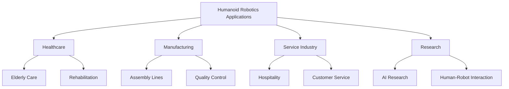
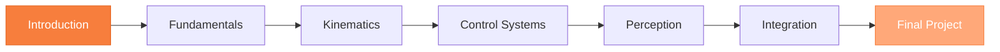

import ReadingTime from '@site/src/components/ReadingTime';
import PersonalizeButton from "@site/src/components/PersonalizeButton"

<PersonalizeButton/>

<h1 className="main-heading" id="introduction">جسمانی ای آئی اور ہیومنوائڈ روبوٹکس کا تعارف</h1>
<div className="underline-class"></div>

<ReadingTime minutes={8} />

جسمانی ای آئی اور ہیومنوائڈ روبوٹکس کی کتاب کے تعارفی ماڈیول میں خوش آمدید۔ یہ ماڈیول آپ کو اس شعبے کا جائزہ، اس کی اہمیت، اور بنیادی تصورات فراہم کرے گا جن کی آپ کو کورس میں آگے بڑھنے کے لیے ضرورت ہوگی۔

<div className="border-line"></div>

---

<h2 className="second-heading" id="learning-objectives">
 سیکھنے کے اہداف
</h2>
<div className="underline-class"></div>

اس ماڈیول کے اختتام تک، آپ کے اہل ہوں گے:

- • **وضاحت کرنا** جسمانی ای آئی اور اس کا ہیومنوائڈ روبوٹکس سے تعلق
- • **سمجھنا** ہیومنوائڈ روبوٹ سسٹم کے اہم اجزاء
- • **شناخت کرنا** ہیومنوائڈ روبوٹکس میں اہم چیلنجز اور مواقع
- • **پہچاننا** جسمانی ای آئی تحقیق کی بین الاقوامی نوعیت
- • **سیٹ اپ کرنا** اپنے روبوٹکس پروگرامنگ کے لیے ترقی کا ماحول

<div className="border-line"></div>

---

<h2 className="second-heading" id="prerequisites">
ضروریات
</h2>
<div className="underline-class"></div>

اس ماڈیول کا آغاز کرنے سے پہلے، آپ کے پاس ہونا چاہیے:

| ضرورت | تفصیل |
|-------------|-------------|
| **پروگرامنگ** | پائی تھون کی بنیادی سمجھ |
| **کمانڈ لائن** | لینکس/یونکس کمانڈز کے ساتھ واقفیت |
| **ریاضی** | لکیری الجبرا اور بنیادی کیلکولس |
| **دلچسپی** | روبوٹکس اور ای آئی میں جذبہ |

<div className="border-line"></div>

---

<h2 className="second-heading" id="module-overview">
ماڈیول کا جائزہ
</h2>
<div className="underline-class"></div>

یہ ماڈیول درج ذیل موضوعات کو احاطہ کرتا ہے:

<h3 className="third-heading" id="what-is-physical-ai">
جسمانی ای آئی کیا ہے؟
</h3>
<div className="underline-class"></div>

جسمانی ای آئی مصنوعی ذہانت اور جسمانی سسٹمز کا اتحاد ہے، جو مشینوں کو حقیقی دنیا کے ساتھ بات چیت کرنے اور نیویگیٹ کرنے کے قابل بناتا ہے۔

:::info کلیدی تصور
جسمانی ای آئی ادراک، فیصلہ سازی، اور ایکٹوایشن کو جوڑتا ہے تاکہ ذہین جسمانی سسٹمز بنائے جا سکیں۔
:::

<div className="border-line"></div>

<h3 className="third-heading" id="humanoid-robotics-intro">
ہیومنوائڈ روبوٹکس کا تعارف
</h3>
<div className="underline-class"></div>

ہیومنوائڈ روبوٹ مشینیں ہیں جو انسان کی شکل اور فعل کو نقل کرنے کے لیے ڈیزائن کی گئی ہیں، جو مکینیکل انجینئرنگ، ای آئی، اور سینسر ٹیکنالوجی کو جوڑتی ہیں۔

**اہم خصوصیات:**
- ◦ بائی پیڈل لوکوموشن
- ◦ انسان کی طرح مورفولوجی
- ◦ ترقی یافتہ حسی نظام
- ◦ موافق سلوک

<div className="border-line"></div>

<h3 className="third-heading" id="key-technologies">
اہم ٹیکنالوجیز اور اجزاء
</h3>

<div className="underline-class"></div>

<h4 className="fourth-heading" id="hardware-components">
ہارڈ ویئر اجزاء
</h4>

<div className="underline-class"></div>

- ➤ **سینسرز**
  - ▸ وژن سسٹمز (RGB، ڈیپتھ کیمرے)
  - ▸ جگہ کے نکشے کے لیے لیڈار
  - ▸ توازن اور سمت کے لیے IMU
  - ▸ قوت/ٹورک سینسرز

- ➤ **ایکچوایٹرز**
  - ▸ الیکٹرک موٹر
  - ▸ ہائیڈرولک سسٹم
  - ▸ پنومیٹک ایکچوایٹرز
  - ▸ سافٹ روبوٹکس

<div className="border-line"></div>

<h4 className="fourth-heading" id="software-components">
سافٹ ویئر اجزاء
</h4>
<div className="underline-class"></div>

- ➤ **ادراک سسٹم**
  - ▸ کمپیوٹر وژن
  - ▸ آبجیکٹ ڈیٹیکشن اور ٹریکنگ
  - ▸ ڈیپتھ اسٹیمیشن

- ➤ **کنٹرول سسٹم**
  - ▸ ریل ٹائم پروسیسنگ
  - ▸ فیڈ بیک کنٹرول لوپس
  - ▸ موشن پلاننگ

- ➤ **ای آئی ماڈلز**
  - ▸ ادراک کے لیے ڈیپ لرننگ
  - ▸ کنٹرول کے لیے ریانفورسمنٹ لرننگ
  - ▸ قدرتی زبان کی پروسیسنگ

<div className="border-line"></div>

<h3 className="third-heading" id="applications">
اطلاقیات اور استعمال کے معاملات
</h3>
<div className="underline-class"></div>



**حقیقی دنیا کے اطلاقیات:**

<h4 className="fourth-heading" id="healthcare">
1. ہیلتھ کیئر اور بوڑھوں کی دیکھ بھال
</h4>
<div className="underline-class"></div>

- • مریض کی مدد
- • جسمانی علاج کی معاونت
- • بوڑھوں کے لیے دوستی

<h4 className="fourth-heading" id="manufacturing">
2. مینوفیکچرنگ اور صنعتی خودکاری
</h4>
<div className="underline-class"></div>

- • لچکدار اکٹھا کرنا کام
- • معیار کی جانچ
- • خطرناک ماحول کے کام

<h4 className="fourth-heading" id="service">
3. سروس اور ہسپتالیت
</h4>
<div className="underline-class"></div>

- • وصولی اور ہدایت
- • کھانے کی سروس
- • صفائی اور دیکھ بھال

<h4 className="fourth-heading" id="research">
4. تحقیق اور تعلیم
</h4>
<div className="underline-class"></div>

- • انسان-روبوٹ بات چیت کے مطالعات
- • تعلیمی مظاہرے
- • ای آئی الگورتھم کی ترقی

<h4 className="fourth-heading" id="disaster-response">
5. آفت کا جواب اور بچاؤ
</h4>
<div className="underline-class"></div>

- • تلاش اور بچاؤ کے کام
- • خطرناک مادہ کا سامان
- • بنیادی ڈھانچہ کی جانچ

<div className="border-line"></div>

<h3 className="third-heading" id="dev-setup">
ترقی کے ماحول کا سیٹ اپ
</h3>
<div className="underline-class"></div>

:::tip شروع کرنا
ہم آپ کو اس کے ساتھ ساتھ اس کے ساتھ روبوٹکس ترقی کے ماحول کو سیٹ کرنا سکھائیں گے۔
:::

<div className="border-line"></div>

**ضروری اوزار:**

```bash
# ROS (Robot Operating System) انسٹال کریں
sudo apt update
sudo apt install ros-noetic-desktop-full

# پائی تھون ماحول سیٹ اپ کریں
python3 -m venv robotics-env
source robotics-env/bin/activate
pip install numpy scipy matplotlib

# سیمولیشن ٹولز انسٹال کریں
sudo apt install gazebo11
```

**تجویز کردہ IDEs:**
- • VS Code پائی تھون اور ROS ایکسٹینشنز کے ساتھ
- • PyCharm پروفیشنل
- • تجربات کے لیے جوپیٹر نوٹ بک

<div className="border-line"></div>

---

<h2 className="second-heading" id="what-youll-build">
آپ کیا بنائیں گے
</h2>

<div className="underline-class"></div>

اس کورس کے دوران، آپ کریں گے:

✅ بنیادی روبوٹکس کے تصورات سیکھیں گے
✅ سیمولیشن ٹولز (گیزبو، موجوکو) کے ساتھ کام کریں گے
✅ کنٹرول الگورتھم تیار کریں گے
✅ روبوٹ ادراک کے لیے ای آئی ماڈلز نافذ کریں گے
✅ مکمل ہیومنوائڈ روبوٹ پروجیکٹ بنائیں گے

<div className="border-line"></div>

---

<h2 className="second-heading" id="learning-path">
سیکھنے کا راستہ
</h2>
<div className="underline-class"></div>



<div className="border-line"></div>

---

<h2 className="second-heading" id="tips">
کامیابی کے لیے نکات
</h2>
<div className="underline-class"></div>

:::tip مطالعہ کی حکمت عملیاں
- • کوڈنگ کی مثالوں کی باقاعدہ مشق کریں
- • سیکھتے وقت چھوٹے پروجیکٹس بنائیں
- • آن لائن روبوٹکس کمیونٹیز میں شامل ہوں
- • سیمولیشنز کے ساتھ تجربہ کریں
:::

:::warning عام مسائل
- • ریاضی کی بنیادوں کو نہ چھوڑیں
- • ہمیشہ ہارڈ ویئر سے پہلے سیمولیشن میں ٹیسٹ کریں
- • پہلے دن سے ہی اپنے کوڈ کو ورژن کنٹرول کریں
:::

<div className="border-line"></div>

---

<h2 className="second-heading" id="resources">
اضافی وسائل
</h2>
<div className="underline-class"></div>

- • [ROS دستاویزات](https://docs.ros.org/)
- • [OpenAI روبوٹکس تحقیق](https://openai.com/research/robotics)
- • [IEEE روبوٹکس اور آٹومیشن سوسائٹی](https://www.ieee-ras.org/)

---

<h2 className="second-heading" id="assessment">
جائزہ
</h2>
<div className="underline-class"></div>

ان سوالات کے ساتھ اپنی سمجھ کو ٹیسٹ کریں:

- 1. جسمانی ای آئی کیا ہے اور یہ روایتی ای آئی سے کیسے مختلف ہے؟
- 2. ہیومنوائڈ روبوٹ سسٹم کے تین اہم اجزاء کے نام بتائیں
- 3. آج ہیومنوائڈ روبوٹکس میں کیا بڑی چیلنجز ہیں؟

<div className="border-line"></div>

---

<h2 className="second-heading" id="next-steps">
اگلے اقدامات
</h2>
<div className="underline-class"></div>

گہرائی میں جانے کے لیے تیار ہیں؟ اگلے سیکشن پر جاری رکھیں:

👉 [جسمانی ای آئی کیا ہے؟](./01-welcome.md)

<div className="border-line"></div>

---

<div style={{textAlign: 'center', marginTop: '40px', padding: '20px', background: 'var(--color-background-card-example)', borderRadius: '12px'}}>
  <h3 style={{color: 'var(--color-accent)'}}>سوالات یا رائے؟</h3>
  <p>کورس فورم یا آفس آؤر کے ذریعے رابطہ کرنے میں آزاد محسوس کریں!</p>
</div>