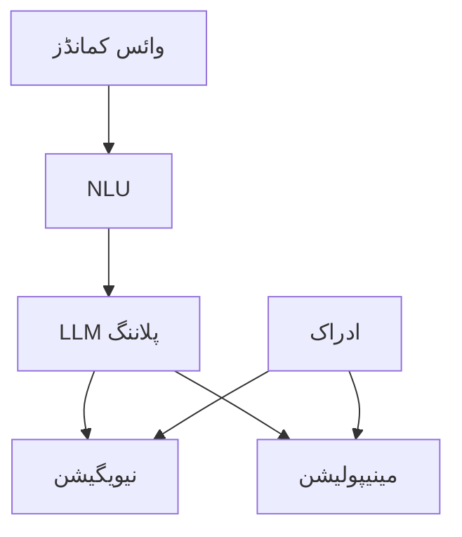

import ReadingTime from '@site/src/components/ReadingTime';
import ViewToggle from '@site/src/components/ViewToggle';


<ReadingTime minutes={15} />

<h1 className="main-heading">کیپسٹون پروجیکٹ جائزہ</h1>
<div className="underline-class"></div>

<div className="full-content">

<div className="border-line"></div>

<h2 className="second-heading">سیکھنے کے اہداف</h2>
<div className="underline-class"></div>

- کیپسٹون پروجیکٹ کے دائرہ کار اور اہداف کو سمجھنا
- کلیدی اجزاء اور ذیلی سسٹمز کی شناخت کرنا
- ترقی اور یکجہتی کے مراحل کو منصوبہ بند کرنا
- کامیابی کے اقدار اور میٹرکس قائم کرنا
- وائس، نیویگیشن، اور مینیپولیشن سسٹمز کو مربوط کرنا

<div className="border-line"></div>

<h2 className="second-heading">تعارف</h2>
<div className="underline-class"></div>

کیپسٹون پروجیکٹ وژن-لینگویج-ایکشن (VLA) پیراڈائم کا استعمال کرتے ہوئے تمام فزیکل AI اور ہیومنوائڈ روبوٹکس کے تصورات کو ایک مکمل ہیومنوائڈ روبوٹ سسٹم میں یکجا کرتا ہے۔ سسٹم وائس کمانڈز وصول کرتا ہے، ماحول کی تشریح کرتا ہے، ایکشنز کو منصوبہ بند کرتا ہے، اور درستگی کے ساتھ نافذ کرتا ہے۔

<div className="border-line"></div>

<h2 className="second-heading">پروجیکٹ کی ضروریات</h2>
<div className="underline-class"></div>

<h3 className="third-heading"> functional ضروریات</h3>
<div className="underline-class"></div>

**وائس کمانڈ پروسیسنگ**
- ملٹی اسٹیپ کمانڈز کے لیے قدرتی لینگویج کی سمجھ
- متن کے مطابق ڈائیلاگ مینجمنٹ
- پلاننگ کے لیے LLM یکجہتی

**خودکار نیویگیشن**
- متحرک ماحول میں محفوظ نیویگیشن
- رکاوٹوں سے بچاؤ کے ساتھ پاتھ پلاننگ
- ریل ٹائم مقام اور نقشہ سازی

**آبجیکٹ مینیپولیشن**
- مختلف اشیاء کی درست مینیپولیشن
- آبجیکٹ کی پہچان اور پوز ایسٹیمیشن
- انسان کے ساتھ محفوظ تعامل

**سسٹم یکجہتی**
- ذیلی سسٹمز کے درمیان ریل ٹائم مربوطگی
- خامی کا انتظام اور بازیافت
- سیفٹی سسٹمز

<div className="border-line"></div>

<h3 className="third-heading"> technical ضروریات</h3>
<div className="underline-class"></div>

**ہارڈ ویئر**: 18+ DOF ہیومنوائڈ، RGB-D کیمرہ، مائیکروفون ایرے، ٹیکٹائل سینسرز، IMU

**سافٹ ویئر**: ROS 2، Isaac Sim، Isaac ROS، ماڈیولر ڈیزائن

**کارکردگی**: جواب < 2سی، نیویگیشن < 5سیمی خامی، مینیپولیشن > 85% کامیابی، اپ ٹائم > 95%

<div className="border-line"></div>

<h2 className="second-heading">سسٹم آرکیٹیکچر</h2>
<div className="underline-class"></div>

<h3 className="third-heading"> بلند سطحی آرکیٹیکچر</h3>
<div className="underline-class"></div>



<div className="border-line"></div>

<h3 className="third-heading">جزوں کی یکجہتی</h3>
<div className="underline-class"></div>

**رابطہ**: ROS 2 ٹاپکس، ایکشن سروسز، پیرامیٹر سرور

**ڈیٹا فلو**: ریل ٹائم سٹریمنگ، بفر مینجمنٹ، QoS ترتیبات

**سیفٹی**: خامی کا پتہ لگانا، نرمی سے کم کرنا، ہنگامی روکنا

<div className="border-line"></div>

<h2 className="second-heading">وائس سسٹم یکجہتی</h2>
<div className="underline-class"></div>

<h3 className="third-heading">NLP پائپ لائن</h3>
<div className="underline-class"></div>

```python
class VoiceSystemIntegrator:
    def __init__(self):
        rospy.init_node('voice_system')
        self.recognizer = sr.Recognizer()
        self.nlp_pipeline = pipeline("text-classification")

    def process_voice_command(self, audio):
        text = self.speech_to_text(audio)
        nlu_result = self.understand(text)
        task = self.plan_task(nlu_result)
        self.execute(task)
```

<div className="border-line"></div>

<h3 className="third-heading">ڈائیلاگ مینجمنٹ</h3>
<div className="underline-class"></div>

```python
class DialogueManager:
    def __init__(self):
        self.context = {'current_task': None, 'history': []}

    def process_input(self, user_input):
        if self.is_continuation(user_input):
            return self.continue_task(user_input)
        return self.start_new_task(user_input)
```

<div className="border-line"></div>

<h2 className="second-heading">نیویگیشن سسٹم</h2>
<div className="underline-class"></div>

<h3 className="third-heading">نیویگیشن آرکیٹیکچر</h3>
<div className="underline-class"></div>

```python
class NavigationSystemIntegrator:
    def __init__(self):
        self.global_planner = GlobalPlanner()
        self.local_planner = LocalPlanner()
        self.safety_monitor = SafetyMonitor()

    def navigate_to_pose(self, target):
        if not self.is_reachable(target):
            return False
        path = self.global_planner.plan(target)
        return self.follow_path(path)
```

<div className="border-line"></div>

<h2 className="second-heading">مینیپولیشن سسٹم</h2>
<div className="underline-class"></div>

<h3 className="third-heading">مینیپولیشن آرکیٹیکچر</h3>
<div className="underline-class"></div>

```python
class ManipulationSystemIntegrator:
    def __init__(self):
        self.ik_solver = InverseKinematicsSolver()
        self.gripper = GripperController()

    def grasp_object(self, obj_info):
        approach = self.calc_approach(obj_info)
        grasp = self.calc_grasp(obj_info)
        self.move_to_pose(approach)
        self.execute_grasp(grasp, obj_info)
        return self.verify_grasp()
```

<div className="border-line"></div>

<h2 className="second-heading">یکجہتی کی چیلنج</h2>
<div className="underline-class"></div>

<h3 className="third-heading">ریل ٹائم کارکردگی</h3>
<div className="underline-class"></div>

**ٹائم نگ**: ادراک < 50ms، پلاننگ < 200ms، کنٹرول 50-100Hz

**وسائل**: CPU/GPU تفویض، میموری مینجمنٹ، I/O بینڈ وڈتھ

<div className="border-line"></div>

<h3 className="third-heading">سیفٹی اور قابل اعتمادی</h3>
<div className="underline-class"></div>

**سیفٹی**: ہنگامی روکنا، رکاوٹوں سے بچاؤ، قوت کو محدود کرنا

**قابل اعتمادی**: جزو کی نگرانی، خامی کی بازیافت، صحت کی اطلاع

<div className="border-line"></div>

<h3 className="third-heading">ٹیسٹنگ</h3>
<div className="underline-class"></div>

**یونٹ**: جزو کی افادیت، انٹرفیس مطابقت

**یکجہتی**: آخر تک کی افادیت، دباؤ ٹیسٹنگ

**سسٹم**: حقیقی دنیا کے منظر نامے، طویل مدت کا آپریشن

<div className="border-line"></div>

<h2 className="second-heading">کامیابی کے اقدار</h2>
<div className="underline-class"></div>

<h3 className="third-heading"> functional میٹرکس</h3>
<div className="underline-class"></div>

**ٹاسک مکمل کرنا**: کمانڈ کامیابی کی شرح، ٹاسک مکمل کرنے کا وقت

**نیویگیشن**: پاتھ کی کارآمدی، رکاوٹوں سے بچاؤ، محل وقوع کی درستگی

**مینیپولیشن**: گریسپ کامیابی کی شرح، جگہ درستگی

**تعامل**: NLU درستگی، ڈائیلاگ کی مطابقت

<div className="border-line"></div>

<h3 className="third-heading"> technical میٹرکس</h3>
<div className="underline-class"></div>

**کارکردگی**: ریل ٹائم مطابقت، وسائل کا استعمال، تاخیر، اپ ٹائم

**مضبوطی**: ناکامی کی شرح، بازیافت کا وقت، دباؤ کارکردگی

<div className="border-line"></div>

<h2 className="second-heading">پروجیکٹ ٹائم لائن</h2>
<div className="underline-class"></div>

<h3 className="third-heading">مرحلہ 1: جزو کی ترقی (ہفتے 1-4)</h3>
<div className="underline-class"></div>

انفرادی ذیلی سسٹمز نافذ کریں اور ٹیسٹ کریں

<div className="border-line"></div>

<h3 className="third-heading">مرحلہ 2: ذیلی سسٹم یکجہتی (ہفتے 5-8)</h3>
<div className="underline-class"></div>

وائس، نیویگیشن، اور مینیپولیشن کو یکجا کریں

<div className="border-line"></div>

<h3 className="third-heading">مرحلہ 3: مکمل یکجہتی (ہفتے 9-12)</h3>
<div className="underline-class"></div>

سیفٹی خصوصیات کے ساتھ مکمل سسٹم یکجہتی

<div className="border-line"></div>

<h3 className="third-heading">مرحلہ 4: توثیق (ہفتے 13-16)</h3>
<div className="underline-class"></div>

بہتری، توثیق، اور دستاویزات

<div className="border-line"></div>

<h2 className="second-heading">خلاصہ</h2>
<div className="underline-class"></div>

کیپسٹون پروجیکٹ وائس پروسیسنگ، نیویگیشن، اور مینیپولیشن کو متحد VLA سسٹم میں یکجا کرتا ہے۔ ماڈیولر آرکیٹیکچر نظامی ترقی اور ٹیسٹنگ کو فعال کرتا ہے۔ کامیابی کے لیے سسٹم آرکیٹیکچر، ریل ٹائم کارکردگی، سیفٹی، اور جامع ٹیسٹنگ پر توجہ کی ضرورت ہے۔

<div className="border-line"></div>

<h2 className="second-heading">ورقے</h2>
<div className="underline-class"></div>

1. بلند سطحی آرکیٹیکچر ڈیزائن کریں
2. میل کے پتھروں کے ساتھ ٹائم لائن تخلیق کریں
3. یکجہتی کی چیلنج کی شناخت کریں
4. ٹیسٹنگ کا نقطہ نظر منصوبہ بند کریں
5. کامیابی کے معیار قائم کریں

<div className="border-line"></div>

<h2 className="second-heading">مزید پڑھائی</h2>
<div className="underline-class"></div>

- "Humanoid Robotics: A Reference" by Venture et al.
- "Robotics, Vision and Control" by Corke
- "Probabilistic Robotics" by Thrun et al.
- "Springer Handbook of Robotics" by Siciliano and Khatib

</div>