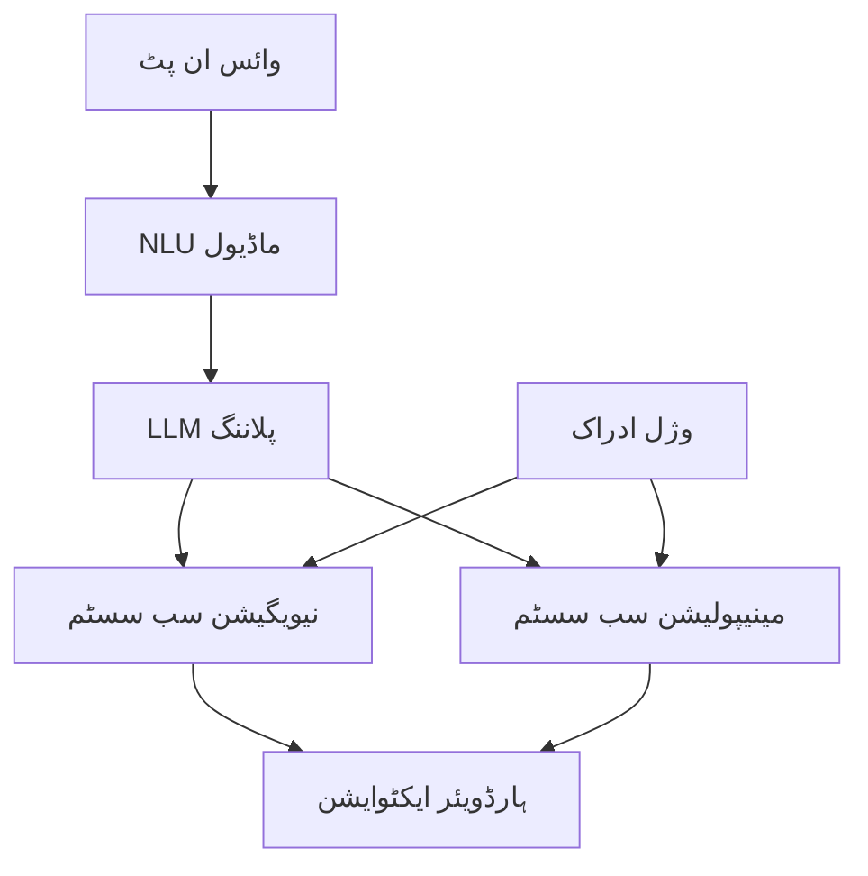

import ReadingTime from '@site/src/components/ReadingTime';
import ViewToggle from '@site/src/components/ViewToggle';


<ReadingTime minutes={20} />

<h1 className="main-heading">سسٹم آرکیٹیکچر یکجہتی</h1>
<div className="underline-class"></div>

<div className="full-content">

<div className="border-line"></div>

<h2 className="second-heading">سیکھنے کے اہداف</h2>
<div className="underline-class"></div>

- ہیومنوائڈ روبوٹ سسٹم کے لیے مکمل آرکیٹیکچر ڈیزائن کرنا
- مختلف ذیلی سسٹمز کے درمیان یکجہتی کو سمجھنا
- ماڈیولر اور قابل توسیع ڈیزائن کو نافذ کرنا
- کارکردگی اور سیفٹی کے اقدار کو پورا کرنا
- ROS 2، Isaac، اور VLA یکجہتی کو منظم کرنا

<div className="border-line"></div>

<h2 className="second-heading">تعارف</h2>
<div className="underline-class"></div>

سسٹم آرکیٹیکچر یکجہتی کا مرکزی مقصد تمام ذیلی سسٹمز کو ایک مربوط اور مربوط طریقے سے جوڑنا ہے تاکہ ہیومنوائڈ روبوٹ مؤثر طریقے سے کام کر سکے۔ یہ ROS 2، Isaac Sim، VLA، اور دیگر ٹیکنالوجیز کو ایک ساتھ مربوط کرتا ہے۔

<div className="border-line"></div>

<h2 className="second-heading">آرکیٹیکچر کی سطحیں</h2>
<div className="underline-class"></div>

<h3 className="third-heading"> بلند سطحی آرکیٹیکچر</h3>
<div className="underline-class"></div>



<div className="border-line"></div>

<h3 className="third-heading"> ماڈیولر ڈیزائن</h3>
<div className="underline-class"></div>

- **وائس ماڈیول**: اسپیچ ریکگنیشن، NLU، ڈائیلاگ مینجمنٹ
- **نیویگیشن ماڈیول**: SLAM، پاتھ پلاننگ، رکاوٹوں سے بچاؤ
- **مینیپولیشن ماڈیول**: IK حل، گریسپ پلاننگ، فورس کنٹرول
- **ادراک ماڈیول**: آبجیکٹ ڈیٹیکشن، لوکلائزیشن، سینسروں کا ادراک

<div className="border-line"></div>

<h2 className="second-heading">ROS 2 یکجہتی</h2>
<div className="underline-class"></div>

<h3 className="third-heading"> ROS 2 نوڈس اور ٹاپکس</h3>
<div className="underline-class"></div>

```python
class SystemIntegratorNode(Node):
    def __init__(self):
        super().__init__('system_integrator')

        # سب سکرائبرز
        self.voice_sub = self.create_subscription(String, 'voice_commands', self.voice_callback, 10)
        self.vision_sub = self.create_subscription(Image, 'camera/image_raw', self.vision_callback, 10)

        # پبلیشرز
        self.nav_pub = self.create_publisher(PoseStamped, 'navigation/goal', 10)
        self.manip_pub = self.create_publisher(JointState, 'manipulation/goal', 10)

        # سروسز
        self.execute_srv = self.create_service(ExecuteTask, 'execute_task', self.execute_task_callback)
```

<div className="border-line"></div>

<h3 className="third-heading"> ایکشن سرورز</h3>
<div className="underline-class"></div>

```python
class NavigationActionServer:
    def __init__(self, node):
        self._action_server = ActionServer(
            node,
            NavigateToPose,
            'navigate_to_pose',
            self.execute_callback)

    def execute_callback(self, goal_handle):
        # نیویگیشن ٹاسک نافذ کریں
        pass
```

<div className="border-line"></div>

<h2 className="second-heading">Isaac یکجہتی</h2>
<div className="underline-class"></div>

<h3 className="third-heading"> Isaac ROS کمپوننٹس</h3>
<div className="underline-class"></div>

```python
class IsaacIntegrator:
    def __init__(self):
        # Isaac ROS کمپوننٹس کو ترتیب دیں
        self.ros_bridge = ROSBridge()
        self.perception_pipeline = PerceptionPipeline()

    def integrate_with_ros(self):
        # Isaac Sim کو ROS 2 کے ساتھ جوڑیں
        pass
```

<div className="border-line"></div>

<h2 className="second-heading">VLA یکجہتی</h2>
<div className="underline-class"></div>

<h3 className="third-heading"> VLA ماڈلز</h3>
<div className="underline-class"></div>

```python
class VLAIntegrator:
    def __init__(self):
        self.vla_model = VLAModel.from_pretrained("openvla/openvla-7b")

    def process_vla_command(self, text_command, image_input):
        # VLA ماڈل استعمال کریں
        action = self.vla_model.predict(text_command, image_input)
        return action
```

<div className="border-line"></div>

<h2 className="second-heading">سیفٹی اور مانیٹرنگ</h2>
<div className="underline-class"></div>

<h3 className="third-heading"> سیفٹی سسٹم</h3>
<div className="underline-class"></div>

```python
class SafetyMonitor:
    def __init__(self):
        self.emergency_stop = False
        self.collision_detected = False

    def check_safety_conditions(self):
        # سیفٹی کنڈیشنز چیک کریں
        if self.collision_detected or self.emergency_stop:
            self.trigger_safety_procedures()
```

<div className="border-line"></div>

<h2 className="second-heading">کارکردگی کی بہتری</h2>
<div className="underline-class"></div>

<h3 className="third-heading"> ریل ٹائم کارکردگی</h3>
<div className="underline-class"></div>

- اعلی ترجیح والے نوڈس کے لیے RT ترتیبات
- ڈیٹا فلو کے لیے QoS ترتیبات
- CPU/GPU وسائل کی مناسب تفویض

<div className="border-line"></div>

<h2 className="second-heading">یکجہتی کے چیلنج</h2>
<div className="underline-class"></div>

- مختلف ٹائم زونز کے ساتھ ڈیٹا کو سینک کرنا
- ROS 2 اور Isaac Sim کے درمیان کمیونیکیشن
- VLA ماڈلز کے لیے کم لیٹنسی
- سیفٹی اور کارکردگی کے درمیان توازن

<div className="border-line"></div>

<h2 className="second-heading">خلاصہ</h2>
<div className="underline-class"></div>

سسٹم آرکیٹیکچر یکجہتی تمام ذیلی سسٹمز کو ایک مربوط ایکو سسٹم میں جوڑنے کا عمل ہے۔ کامیاب یکجہتی کے لیے مناسب ڈیزائن، سیفٹی، اور کارکردگی کی ترتیبات کی ضرورت ہے۔

<div className="border-line"></div>

<h2 className="second-heading">ورقے</h2>
<div className="underline-class"></div>

1. سسٹم آرکیٹیکچر ڈیزائن کریں
2. ROS 2 نوڈس نافذ کریں
3. Isaac یکجہتی ٹیسٹ کریں
4. VLA ماڈلز کو ضم کریں
5. سیفٹی سسٹم نافذ کریں

</div>