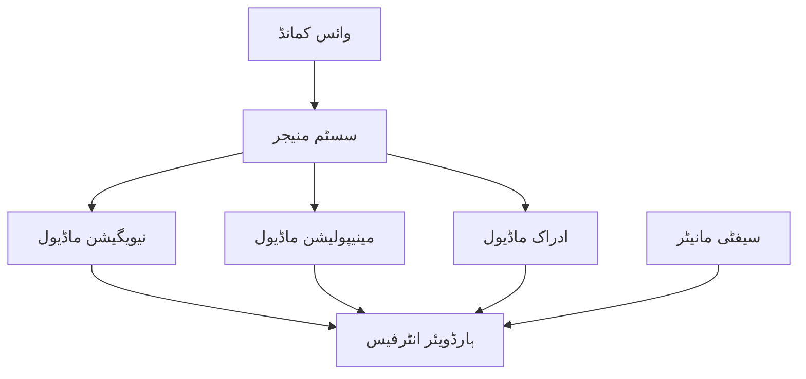

import ReadingTime from '@site/src/components/ReadingTime';
import ViewToggle from '@site/src/components/ViewToggle';

<ReadingTime minutes={40} />

<h1 className="main-heading">مکمل سسٹم یکجہتی</h1>
<div className="underline-class"></div>

<div className="full-content">

<div className="border-line"></div>

<h2 className="second-heading">سیکھنے کے اہداف</h2>
<div className="underline-class"></div>

- تمام ذیلی سسٹمز (وائس، نیویگیشن، مینیپولیشن) کو مکمل طور پر یکجا کرنا
- سسٹم کے درمیان کمیونیکیشن اور ڈیٹا فلو کو منظم کرنا
- مکمل سسٹم کی کارکردگی کو بہتر بنانا
- ایمرجنسی اسٹاپ اور سیفٹی میکنزمز نافذ کرنا
- مکمل ہیومنوائڈ روبوٹ سسٹم کی توثیق اور ٹیسٹنگ کرنا

<div className="border-line"></div>

<h2 className="second-heading">تعارف</h2>
<div className="underline-class"></div>

مکمل سسٹم یکجہتی تمام ذیلی سسٹمز کو ایک مربوط ایپلیکیشن میں جوڑنے کا عمل ہے۔ یہ ROS 2، Isaac Sim، VLA، اور تمام پچھلے ماڈیولز کو ایک ساتھ مربوط کرتا ہے تاکہ مکمل ہیومنوائڈ روبوٹ کام کر سکے۔

<div className="border-line"></div>

<h2 className="second-heading">سسٹم آرکیٹیکچر</h2>
<div className="underline-class"></div>

<h3 className="third-heading"> بلند سطحی سسٹم ڈائیگرام</h3>
<div className="underline-class"></div>



<div className="border-line"></div>

<h3 className="third-heading"> کمیونیکیشن پروٹوکول</h3>
<div className="underline-class"></div>

- **ROS 2 ٹاپکس**: سینسر ڈیٹا، کمانڈز، اسٹیٹس
- **ROS 2 سروسز**: ایکشنز، توثیق، کنفیگریشن
- **ROS 2 ایکشنز**: طویل مدتی ٹاسکس، پیشرفت کی رپورٹنگ
- **QoS ترتیبات**: مہذب ڈیٹا کے لیے موزوں سیٹنگز

<div className="border-line"></div>

<h2 className="second-heading">سسٹم منیجر</h2>
<div className="underline-class"></div>

<h3 className="third-heading"> ٹاسک شیڈولنگ</h3>
<div className="underline-class"></div>

```python
class SystemManager(Node):
    def __init__(self):
        super().__init__('system_manager')
        self.task_scheduler = TaskScheduler()
        self.state_machine = StateMachine()
        self.safety_monitor = SafetyMonitor()

    def process_command(self, command):
        # کمانڈ کو تجزیہ کریں اور منصوبہ بند کریں
        task_plan = self.analyze_command(command)
        if self.safety_monitor.check_safety(task_plan):
            self.execute_task_plan(task_plan)
        else:
            self.get_logger().error('Safety check failed for task plan')
```

<div className="border-line"></div>

<h3 className="third-heading"> ریسورس مینجمنٹ</h3>
<div className="underline-class"></div>

```python
class ResourceManager:
    def __init__(self):
        self.cpu_monitor = CPUMonitor()
        self.gpu_monitor = GPUMonitor()
        self.memory_manager = MemoryManager()

    def allocate_resources(self, task_requirements):
        # CPU، GPU، اور میموری وسائل کو تفویض کریں
        resources = {}
        if task_requirements.need_gpu:
            resources['gpu'] = self.gpu_monitor.reserve_gpu()
        if task_requirements.need_cpu:
            resources['cpu'] = self.cpu_monitor.reserve_cpu(task_requirements.cpu_cores)
        return resources
```

<div className="border-line"></div>

<h2 className="second-heading">سیفٹی اور ناگہانی بحالی</h2>
<div className="underline-class"></div>

<h3 className="third-heading"> سیفٹی مانیٹر</h3>
<div className="underline-class"></div>

```python
class SafetyMonitor:
    def __init__(self):
        self.emergency_stop = False
        self.collision_detected = False
        self.power_low = False

    def check_safety_conditions(self):
        if self.emergency_stop or self.collision_detected or self.power_low:
            self.trigger_safety_procedures()
            return False
        return True

    def trigger_safety_procedures(self):
        # تمام حرکات کو روکیں، سیف پوز میں جائیں
        pass
```

<div className="border-line"></div>

<h3 className="third-heading"> ناگہانی بحالی</h3>
<div className="underline-class"></div>

```python
class RecoveryManager:
    def __init__(self):
        self.recovery_strategies = {
            'navigation_failure': self.nav_recovery,
            'manipulation_failure': self.manip_recovery,
            'communication_failure': self.comm_recovery
        }

    def handle_failure(self, failure_type, context):
        # ناکامی کے مطابق بازیافت کریں
        if failure_type in self.recovery_strategies:
            return self.recovery_strategies[failure_type](context)
        return False
```

<div className="border-line"></div>

<h2 className="second-heading">کارکردگی کی بہتری</h2>
<div className="underline-class"></div>

<h3 className="third-heading"> ملٹی تھریڈنگ اور موازی پروسیسنگ</h3>
<div className="underline-class"></div>

```python
class ParallelExecutor:
    def __init__(self):
        self.executor = ThreadPoolExecutor(max_workers=8)

    def execute_parallel_tasks(self, tasks):
        # متوازی ٹاسکس ایگزیکیوٹ کریں
        futures = [self.executor.submit(task.execute) for task in tasks]
        results = [future.result() for future in futures]
        return results
```

<div className="border-line"></div>

<h3 className="third-heading"> ڈیٹا کیش اور پریڈکٹو لودنگ</h3>
<div className="underline-class"></div>

```python
class DataCache:
    def __init__(self):
        self.cache = {}
        self.predictor = TaskPredictor()

    def preload_data(self, predicted_task):
        # متوقع ٹاسک کے لیے ڈیٹا پہلے سے لوڈ کریں
        task_data = self.predictor.predict_data_requirements(predicted_task)
        for data_type in task_data:
            if data_type not in self.cache:
                self.cache[data_type] = self.load_data(data_type)
```

<div className="border-line"></div>

<h2 className="second-heading">سسٹم ٹیسٹنگ</h2>
<div className="underline-class"></div>

<h3 className="third-heading"> انٹیگریشن ٹیسٹنگ</h3>
<div className="underline-class"></div>

```python
class IntegrationTester:
    def __init__(self):
        self.test_scenarios = [
            'simple_navigation',
            'object_grasping',
            'voice_command_response',
            'multi_step_task'
        ]

    def run_integration_tests(self):
        results = []
        for scenario in self.test_scenarios:
            result = self.execute_test_scenario(scenario)
            results.append(result)
        return self.calculate_overall_score(results)
```

<div className="border-line"></div>

<h3 className="third-heading"> پرفارمینس ٹیسٹنگ</h3>
<div className="underline-class"></div>

- ریسپانس ٹائم ٹیسٹ
- CPU/GPU استعمال کا تجزیہ
- میموری لیک کا تجزیہ
- طویل مدتی آپریشن ٹیسٹ

<div className="border-line"></div>

<h2 className="second-heading">ڈیپلائمنٹ اور آپریشن</h2>
<div className="underline-class"></div>

<h3 className="third-heading"> سسٹم لانچ فائلز</h3>
<div className="underline-class"></div>

```xml
<launch>
  <!-- تمام نوڈس کو ایک ساتھ لانچ کریں -->
  <node name="voice_system" pkg="voice_pkg" exec="voice_node" />
  <node name="navigation_system" pkg="nav_pkg" exec="nav_node" />
  <node name="manipulation_system" pkg="manip_pkg" exec="manip_node" />
  <node name="system_manager" pkg="system_pkg" exec="system_manager" />
  <node name="safety_monitor" pkg="safety_pkg" exec="safety_node" />
</launch>
```

<div className="border-line"></div>

<h3 className="third-heading"> مانیٹرنگ اور لاگنگ</h3>
<div className="underline-class"></div>

```python
class SystemMonitor:
    def __init__(self):
        self.logger = Logger()
        self.metrics_collector = MetricsCollector()

    def log_system_state(self):
        # سسٹم اسٹیٹس، کارکردگی، اور خامیاں لاگ کریں
        system_state = self.get_system_state()
        self.logger.info(f"System state: {system_state}")
        self.metrics_collector.update(system_state)
```

<div className="border-line"></div>

<h2 className="second-heading">چیلنج اور حل</h2>
<div className="underline-class"></div>

- مختلف فریم ورکس کے درمیان ڈیٹا کنورژن
- کمیونیکیشن لیٹنسی کو کم کرنا
- سیفٹی اور کارکردگی کے درمیان توازن
- ناکامی کے بعد خود بخود بازیافت

<div className="border-line"></div>

<h2 className="second-heading">خلاصہ</h2>
<div className="underline-class"></div>

مکمل سسٹم یکجہتی تمام ذیلی سسٹمز کو ایک مربوط ایپلیکیشن میں جوڑنے کا آخری مرحلہ ہے۔ کامیاب یکجہتی کے لیے سیفٹی، کارکردگی، اور قابل اعتمادی کو توازن دینے کی ضرورت ہے۔

<div className="border-line"></div>

<h2 className="second-heading">ورقے</h2>
<div className="underline-class"></div>

1. سسٹم منیجر نافذ کریں
2. سیفٹی مانیٹر ٹیسٹ کریں
3. انٹیگریشن ٹیسٹس چلائیں
4. کارکردگی کا جائزہ لیں
5. ڈیپلائمنٹ پروسیجر کو تیار کریں

</div>