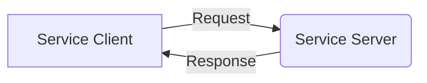
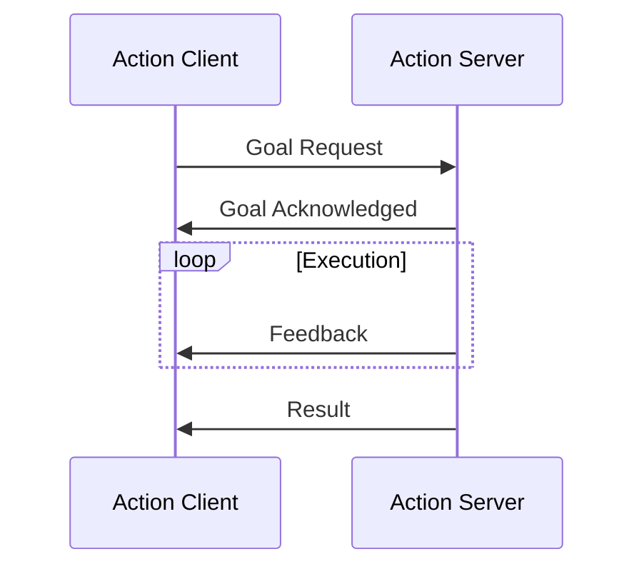

# ROS2 Services and Actions

This comprehensive guide covers the implementation and usage of services and actions in ROS2, which are essential communication patterns for robotics applications. Services provide synchronous request-response communication, while actions enable asynchronous goal-oriented communication.

## Understanding ROS2 Services

ROS2 services implement a request-response communication pattern where a client sends a request to a server and waits for a response. This is ideal for operations that require immediate results.

### Service Architecture

Services follow a client-server model:



The service server provides a specific functionality, while the client consumes it by sending requests and receiving responses.

### Creating a Service Definition

Service definitions are created using `.srv` files that specify the request and response message structures. Here's an example service definition:

```text
# Example service: AddTwoInts.srv
# Request part (before the three dashes)
int64 a
int64 b
---
# Response part (after the three dashes)
int64 sum
```

### Implementing a Service Server

Here's a complete example of a service server implementation:

```python
import rclpy
from rclpy.node import Node
from example_interfaces.srv import AddTwoInts

class MinimalService(Node):
    def __init__(self):
        super().__init__('minimal_service')
        self.srv = self.create_service(
            AddTwoInts,
            'add_two_ints',
            self.add_two_ints_callback
        )

    def add_two_ints_callback(self, request, response):
        response.sum = request.a + request.b
        self.get_logger().info(f'Request received: {request.a} + {request.b} = {response.sum}')
        return response

def main(args=None):
    rclpy.init(args=args)
    minimal_service = MinimalService()

    try:
        rclpy.spin(minimal_service)
    except KeyboardInterrupt:
        pass
    finally:
        minimal_service.destroy_node()
        rclpy.shutdown()

if __name__ == '__main__':
    main()
```

### Implementing a Service Client

Here's how to implement a client that calls the service:

```python
import rclpy
from rclpy.node import Node
from example_interfaces.srv import AddTwoInts

class MinimalClient(Node):
    def __init__(self):
        super().__init__('minimal_client')
        self.cli = self.create_client(AddTwoInts, 'add_two_ints')
        while not self.cli.wait_for_service(timeout_sec=1.0):
            self.get_logger().info('Service not available, waiting again...')
        self.req = AddTwoInts.Request()

    def send_request(self, a, b):
        self.req.a = a
        self.req.b = b
        self.future = self.cli.call_async(self.req)
        rclpy.spin_until_future_complete(self, self.future)
        return self.future.result()

def main(args=None):
    rclpy.init(args=args)
    minimal_client = MinimalClient()

    try:
        response = minimal_client.send_request(42, 36)
        minimal_client.get_logger().info(f'Result: {response.sum}')
    except KeyboardInterrupt:
        pass
    finally:
        minimal_client.destroy_node()
        rclpy.shutdown()

if __name__ == '__main__':
    main()
```

## Understanding ROS2 Actions

Actions provide a more sophisticated communication pattern for long-running tasks. They support goal requests, feedback during execution, and result responses.

### Action Architecture

Actions have a more complex interaction pattern:



### Action States

Actions can be in one of several states:
- **PENDING**: Goal accepted but not yet started
- **ACTIVE**: Goal is being processed
- **PREEMPTED**: Goal was canceled
- **SUCCEEDED**: Goal completed successfully
- **ABORTED**: Goal failed to complete
- **RECALLED**: Goal was recalled

### Creating an Action Definition

Action definitions use `.action` files with three parts:

```text
# Fibonacci.action
# Goal definition
uint32 order
---
# Result definition
uint32[] sequence
---
# Feedback definition
uint32[] sequence
```

### Implementing an Action Server

Here's a complete action server implementation:

```python
import rclpy
from rclpy.action import ActionServer
from rclpy.node import Node
from rclpy.executors import MultiThreadedExecutor
from example_interfaces.action import Fibonacci

class MinimalActionServer(Node):
    def __init__(self):
        super().__init__('minimal_action_server')
        self._action_server = ActionServer(
            self,
            Fibonacci,
            'fibonacci',
            self.execute_callback
        )

    def execute_callback(self, goal_handle):
        self.get_logger().info('Executing goal...')

        feedback_msg = Fibonacci.Feedback()
        feedback_msg.sequence = [0, 1]

        for i in range(1, goal_handle.request.order):
            if goal_handle.is_cancel_requested:
                goal_handle.canceled()
                self.get_logger().info('Goal canceled')
                return Fibonacci.Result()

            feedback_msg.sequence.append(
                feedback_msg.sequence[i] + feedback_msg.sequence[i-1]
            )

            self.get_logger().info(f'Feedback: {feedback_msg.sequence}')
            goal_handle.publish_feedback(feedback_msg)

        goal_handle.succeed()
        result = Fibonacci.Result()
        result.sequence = feedback_msg.sequence
        self.get_logger().info(f'Result: {result.sequence}')

        return result

def main(args=None):
    rclpy.init(args=args)
    minimal_action_server = MinimalActionServer()

    try:
        rclpy.spin(minimal_action_server)
    except KeyboardInterrupt:
        pass
    finally:
        minimal_action_server.destroy_node()
        rclpy.shutdown()

if __name__ == '__main__':
    main()
```

### Implementing an Action Client

Here's how to implement an action client:

```python
import rclpy
from rclpy.action import ActionClient
from rclpy.node import Node
from example_interfaces.action import Fibonacci

class MinimalActionClient(Node):
    def __init__(self):
        super().__init__('minimal_action_client')
        self._action_client = ActionClient(
            self,
            Fibonacci,
            'fibonacci'
        )

    def send_goal(self, order):
        goal_msg = Fibonacci.Goal()
        goal_msg.order = order

        self._action_client.wait_for_server()
        self._send_goal_future = self._action_client.send_goal_async(
            goal_msg,
            feedback_callback=self.feedback_callback
        )

        self._send_goal_future.add_done_callback(self.goal_response_callback)

    def goal_response_callback(self, future):
        goal_handle = future.result()
        if not goal_handle.accepted:
            self.get_logger().info('Goal rejected')
            return

        self.get_logger().info('Goal accepted')
        self._get_result_future = goal_handle.get_result_async()
        self._get_result_future.add_done_callback(self.get_result_callback)

    def feedback_callback(self, feedback_msg):
        feedback = feedback_msg.feedback
        self.get_logger().info(f'Received feedback: {feedback.sequence}')

    def get_result_callback(self, future):
        result = future.result().result
        self.get_logger().info(f'Result: {result.sequence}')

def main(args=None):
    rclpy.init(args=args)
    minimal_action_client = MinimalActionClient()

    minimal_action_client.send_goal(10)

    try:
        rclpy.spin(minimal_action_client)
    except KeyboardInterrupt:
        pass
    finally:
        minimal_action_client.destroy_node()
        rclpy.shutdown()

if __name__ == '__main__':
    main()
```

## Best Practices

### Service Best Practices

- Use services for operations that return results quickly
- Implement proper error handling and timeouts
- Keep service requests lightweight
- Use appropriate data types for requests and responses
- Document expected behavior for edge cases

### Action Best Practices

- Use actions for long-running operations
- Provide meaningful feedback during execution
- Implement proper goal cancellation
- Handle preemption gracefully
- Set appropriate timeouts for goals

## Performance Considerations

When implementing services and actions:

- Monitor response times and set appropriate timeouts
- Consider using multiple service servers for high-load scenarios
- Implement proper resource management for long-running actions
- Use efficient data structures for large message payloads
- Consider bandwidth limitations for distributed systems

## Security Considerations

- Validate all incoming service and action requests
- Implement authentication and authorization where needed
- Sanitize data before processing
- Use secure communication channels
- Implement rate limiting to prevent abuse

## Summary

ROS2 services and actions provide powerful communication patterns for robotics applications:

- **Services** are ideal for synchronous request-response interactions
- **Actions** are perfect for long-running, goal-oriented tasks with feedback
- Both support robust error handling and cancellation
- Proper implementation ensures reliable robot operation

For more information about ROS2 communication patterns, see [Topics](./topics.md) and [Parameters](./parameters.md).

## Next Steps

- Learn about [ROS2 Launch Files](./launch-files.md) to manage complex systems
- Explore [ROS2 Testing](./testing.md) for validation strategies
- Review [ROS2 Best Practices](./best-practices.md) for advanced topics